# Design Document: ReliantAI Integration Platform

## Overview

The ReliantAI Integration Platform is a production-grade integration layer that unifies 13 independent business execution systems into a cohesive cognitive platform. This design addresses the challenge of connecting heterogeneous systems (Rust, Python, TypeScript, Julia) while preserving project autonomy and enabling seamless orchestration.

### Core Design Principles

1. **Zero Tolerance for Mocks**: Every component is real, functional, and production-ready
2. **Project Autonomy**: Each of the 13 projects maintains independence with minimal integration surface
3. **Tenant Isolation**: Multi-tenant architecture with strict data separation
4. **Event-Driven Architecture**: Loose coupling through asynchronous event communication
5. **Defense in Depth**: Multiple security layers (authentication, authorization, encryption, rate limiting)
6. **Observability First**: Comprehensive monitoring, tracing, and alerting from day one

### System Context

The platform integrates:
- **Apex**: 5-layer probabilistic OS with uncertainty calculation and HITL
- **Acropolis**: Adaptive expert platform with polyglot plugin framework
- **Citadel**: Modular AI microservices (Vector Search, Knowledge Graph, Time Series)
- **B-A-P**: Business analytics SaaS with AI-powered insights
- **Money**: HVAC AI dispatch with 5-agent CrewAI chain
- **Gen-H**: HVAC growth platform with lead generation
- **ClearDesk**: AI-powered AR document processing
- **BackupIQ**: Enterprise backup with semantic organization
- **DocuMancer**: Document conversion desktop application
- **intelligent-storage**: RAG + Knowledge Graph file intelligence
- **citadel_ultimate_a_plus**: Lead generation pipeline with state machine
- **reGenesis**: AI-powered website generation
- **CyberArchitect**: Security-focused website replication toolkit

### Key Design Decisions


**Authentication Strategy**: Centralized OAuth2/JWT service with Redis-backed token storage provides single sign-on while avoiding tight coupling. Each project validates tokens independently using shared secret.

**Communication Pattern**: Kafka-based event bus chosen over direct HTTP calls to enable loose coupling, replay capability, and independent scaling. Redis pub/sub considered but rejected due to limited retention and delivery guarantees.

**Service Mesh**: Linkerd selected over Istio for lower resource overhead and simpler operational model. Provides mTLS, circuit breakers, and observability without requiring code changes.

**API Gateway**: Kong chosen for mature plugin ecosystem, performance, and declarative configuration. Handles authentication, rate limiting, and routing at platform edge.

**Database Strategy**: PostgreSQL for multi-tenant services (Apex, B-A-P, Citadel, intelligent-storage) with tenant_id column and row-level security. SQLite with WAL mode for single-tenant services (Money, citadel_ultimate_a_plus).

**Observability Stack**: Prometheus + Grafana + OpenTelemetry provides comprehensive metrics, visualization, and distributed tracing. Langfuse retained for Apex-specific agent observability.

## Architecture

### High-Level Architecture

```mermaid
graph TB
    subgraph "External Clients"
        WebUI[Web UI]
        MobileApp[Mobile App]
        API_Client[API Client]
    end
    
    subgraph "Platform Edge"
        Gateway[Kong API Gateway<br/>Port 8000]
        Auth[Auth Service<br/>Port 8080]
    end
    
    subgraph "Service Mesh - Linkerd"
        subgraph "Tier 1: Core Intelligence"
            Apex[Apex<br/>apex-core:8001<br/>apex-agents:8002]
            Acropolis[Acropolis<br/>Port 8003]
            Citadel[Citadel<br/>Port 8004]
        end
        
        subgraph "Tier 2: Business Operations"
            BAP[B-A-P Analytics<br/>Port 8005]
            Money[Money Dispatch<br/>Port 8006]
            GenH[Gen-H HVAC<br/>Port 8007]
            ClearDesk[ClearDesk AR<br/>Port 8008]
        end
        
        subgraph "Tier 3: Specialized Services"
            BackupIQ[BackupIQ<br/>Port 8009]
            IntStorage[intelligent-storage<br/>Port 8010]
            CitadelPlus[citadel_ultimate_a_plus<br/>Port 8011]
            DocuMancer[DocuMancer<br/>Port 8012]
            ReGenesis[reGenesis<br/>Port 8013]
            CyberArch[CyberArchitect<br/>Port 8014]
        end
    end
    
    subgraph "Event Infrastructure"
        Kafka[Apache Kafka<br/>Port 9092]
        Saga[Saga Orchestrator<br/>Port 8015]
    end
    
    subgraph "Data Layer"
        Postgres[(PostgreSQL<br/>Port 5432)]
        Redis[(Redis<br/>Port 6379)]
        Neo4j[(Neo4j<br/>Port 7687)]
    end
    
    subgraph "Observability"
        Prometheus[Prometheus<br/>Port 9090]
        Grafana[Grafana<br/>Port 3000]
        OTel[OpenTelemetry<br/>Collector]
    end
    
    WebUI --> Gateway
    MobileApp --> Gateway
    API_Client --> Gateway
    
    Gateway --> Auth
    Gateway --> Apex
    Gateway --> Acropolis
    Gateway --> Citadel
    Gateway --> BAP
    Gateway --> Money
    Gateway --> GenH
    Gateway --> ClearDesk
    
    Apex --> Kafka
    Citadel --> Kafka
    Money --> Kafka
    BAP --> Kafka
    GenH --> Kafka
    ClearDesk --> Kafka
    
    Saga --> Kafka
    
    Apex --> Postgres
    BAP --> Postgres
    Citadel --> Postgres
    IntStorage --> Postgres
    
    Money --> Redis
    Auth --> Redis
    
    Citadel --> Neo4j
    BackupIQ --> Neo4j
    
    Apex --> Prometheus
    BAP --> Prometheus
    Money --> Prometheus
    
    Prometheus --> Grafana
    OTel --> Prometheus
```



### Component Interaction Patterns


**Authentication Flow**:
1. Client sends credentials to Auth Service
2. Auth Service validates credentials, generates JWT access token (30min) and refresh token (7 days)
3. Client includes JWT in Authorization header for all subsequent requests
4. API Gateway validates JWT signature and extracts user_id, tenant_id, roles
5. Gateway adds X-User-ID, X-Tenant-ID, X-Correlation-ID headers
6. Service receives request with identity context, enforces tenant isolation

**Event-Driven Communication Flow**:
1. Service A performs operation (e.g., Citadel qualifies lead)
2. Service A publishes event to Kafka topic (e.g., lead.qualified)
3. Kafka persists event for 24 hours
4. Service B subscribes to topic, receives event within 100ms
5. Service B processes event (e.g., Money creates dispatch)
6. If processing fails, event goes to Dead Letter Queue for manual intervention

**Distributed Transaction Flow (Saga Pattern)**:
1. Client initiates multi-service workflow via Saga Orchestrator
2. Orchestrator executes steps sequentially: Step1 → Step2 → Step3
3. Each step stores idempotency key in Redis before execution
4. If Step3 fails, orchestrator executes compensation logic in reverse: Compensate3 → Compensate2 → Compensate1
5. Saga completes with status: completed (all steps succeeded) or failed (compensated)

**Service-to-Service Communication**:
1. Service A makes HTTP request to Service B
2. Linkerd sidecar intercepts request, establishes mTLS connection
3. Circuit breaker checks Service B health (50% error threshold over 10s window)
4. If circuit open, returns 503 immediately without calling Service B
5. If circuit closed, forwards request with distributed tracing headers
6. Implements retry with exponential backoff (1s, 2s, 4s) up to 3 attempts

### Deployment Architecture

**Local Development**:
- Docker Compose orchestrates all services
- Shared network for service discovery
- Volume mounts for hot-reload during development
- Local PostgreSQL, Redis, Kafka, Neo4j instances

**Production (Kubernetes)**:
- Each service deployed as Deployment with 3 replicas minimum
- Horizontal Pod Autoscaler scales based on CPU (70% threshold) and custom metrics
- Blue-green deployment strategy for zero-downtime updates
- Health checks at /health (liveness) and /ready (readiness)
- Persistent volumes for databases with daily backups
- Linkerd service mesh injected via annotation
- Ingress controller routes external traffic to Kong Gateway

## Components and Interfaces

### Auth Service

**Technology**: Python 3.11, FastAPI, Redis, python-jose, passlib

**Responsibilities**:
- User registration and credential management
- OAuth2 token generation (access, refresh)
- Token validation and revocation
- Password hashing with bcrypt (cost factor 12)
- Role-based access control enforcement

**API Endpoints**:

```
POST /token
  Request: OAuth2PasswordRequestForm (username, password)
  Response: {access_token, refresh_token, token_type}
  Status: 200 OK, 401 Unauthorized
  
POST /refresh
  Request: {refresh_token}
  Response: {access_token, token_type}
  Status: 200 OK, 401 Unauthorized
  
POST /register
  Request: {username, password, email, roles, tenant_id}
  Response: {user_id, message}
  Status: 201 Created, 400 Bad Request
  
GET /verify
  Headers: Authorization: Bearer <token>
  Response: {user_id, username, roles, tenant_id}
  Status: 200 OK, 401 Unauthorized
  
POST /revoke
  Request: {token}
  Response: {message}
  Status: 200 OK
  
GET /health
  Response: {status: "healthy", timestamp}
  Status: 200 OK
```

**Configuration**:
- `AUTH_SECRET_KEY`: JWT signing key (256-bit minimum)
- `AUTH_ALGORITHM`: HS256
- `AUTH_ACCESS_TOKEN_EXPIRE_MINUTES`: 30
- `AUTH_REFRESH_TOKEN_EXPIRE_DAYS`: 7
- `AUTH_REDIS_URL`: redis://localhost:6379
- `AUTH_BCRYPT_ROUNDS`: 12

**Dependencies**:
- Redis for token revocation list and refresh token storage
- PostgreSQL for user account persistence (optional, can start with Redis)

**Metrics Exposed**:
- `auth_token_issued_total{grant_type}`: Counter of tokens issued
- `auth_token_validation_total{result}`: Counter of validation attempts
- `auth_login_failures_total`: Counter of failed login attempts
- `auth_request_duration_seconds`: Histogram of request latency


### Event Bus

**Technology**: Apache Kafka 3.6, Python kafka-python, Pydantic

**Responsibilities**:
- Event publishing with schema validation
- Event persistence (24-hour retention)
- Topic-based pub/sub routing
- Dead Letter Queue for failed events
- Event replay by event_id

**Topics**:
- `lead.events`: Lead creation, qualification, conversion
- `dispatch.events`: Dispatch creation, assignment, completion
- `document.events`: Document upload, processing, extraction
- `agent.events`: Agent task creation, execution, completion
- `analytics.events`: Metrics, aggregations, reports
- `saga.events`: Saga orchestration events
- `dlq.events`: Failed events requiring manual intervention

**Event Schema**:
```python
class Event(BaseModel):
    event_id: str  # UUID v4
    event_type: str  # e.g., "lead.qualified"
    source: str  # Service name
    timestamp: datetime  # ISO 8601
    data: Dict[str, Any]  # Event-specific payload
    metadata: Dict[str, Any]  # Correlation ID, tenant ID, etc.
    schema_version: str  # e.g., "1.0"
```

**API (Python Client)**:
```python
class EventBusClient:
    def publish(self, event: Event) -> bool
    def subscribe(self, topic: str, handler: Callable[[Event], None])
    def get_event(self, event_id: str) -> Optional[Event]
    def get_dlq_events(self, limit: int = 100) -> List[Event]
    def replay_event(self, event_id: str) -> bool
```

**Configuration**:
- `KAFKA_BOOTSTRAP_SERVERS`: localhost:9092
- `KAFKA_RETENTION_HOURS`: 24
- `KAFKA_REPLICATION_FACTOR`: 3 (production), 1 (development)
- `KAFKA_PARTITIONS`: 10 per topic
- `EVENT_VALIDATION_ENABLED`: true

**Metrics Exposed**:
- `events_published_total{topic, source}`: Counter of published events
- `events_consumed_total{topic, consumer}`: Counter of consumed events
- `events_failed_total{topic, reason}`: Counter of failed events
- `dlq_size{topic}`: Gauge of DLQ depth
- `event_processing_duration_seconds{topic}`: Histogram of processing time

### API Gateway (Kong)

**Technology**: Kong 3.5, PostgreSQL (Kong database)

**Responsibilities**:
- TLS termination (HTTPS enforcement)
- JWT validation on all requests
- Rate limiting (1000 req/min per user)
- Request routing based on path prefix
- Header injection (X-Correlation-ID, X-User-ID, X-Tenant-ID)
- Request/response logging

**Routing Rules**:
```
/api/apex/*       → apex-core:8001
/api/acropolis/*  → acropolis:8003
/api/citadel/*    → citadel:8004
/api/analytics/*  → b-a-p:8005
/api/dispatch/*   → money:8006
/api/hvac/*       → gen-h:8007
/api/documents/*  → cleardesk:8008
/api/backup/*     → backupiq:8009
/api/storage/*    → intelligent-storage:8010
/api/leads/*      → citadel_ultimate_a_plus:8011
/api/convert/*    → documancer:8012
/api/websites/*   → regenesis:8013
/api/archive/*    → cyberarchitect:8014
```

**Plugins Enabled**:
- `jwt`: JWT validation with HS256 algorithm
- `rate-limiting`: 1000 requests per minute per consumer
- `correlation-id`: Inject X-Correlation-ID header
- `request-transformer`: Add X-User-ID, X-Tenant-ID from JWT
- `prometheus`: Expose metrics at /metrics
- `file-log`: Log all requests to /var/log/kong/access.log

**Configuration**:
- `KONG_DATABASE`: postgres
- `KONG_PG_HOST`: postgres
- `KONG_PG_DATABASE`: kong
- `KONG_PROXY_LISTEN`: 0.0.0.0:8000
- `KONG_ADMIN_LISTEN`: 127.0.0.1:8001

**Metrics Exposed**:
- `kong_http_requests_total{service, route, status}`: Counter of requests
- `kong_request_latency_ms{service}`: Histogram of request latency
- `kong_bandwidth_bytes{type, service}`: Counter of bytes transferred
- `kong_rate_limit_exceeded_total{consumer}`: Counter of rate limit hits

### Service Mesh (Linkerd)

**Technology**: Linkerd 2.14

**Responsibilities**:
- Mutual TLS for all service-to-service communication
- Circuit breakers (50% error threshold, 10s window)
- Automatic retries with exponential backoff
- Distributed tracing header propagation
- Service discovery and load balancing
- Traffic splitting for canary deployments

**Circuit Breaker Configuration**:
```yaml
errorThreshold: 0.5  # Open circuit at 50% error rate
windowDuration: 10s  # Measure errors over 10 seconds
openDuration: 30s    # Keep circuit open for 30 seconds
halfOpenRequests: 10  # Allow 10% traffic when half-open
```

**Retry Configuration**:
```yaml
maxRetries: 3
backoff:
  - 1s
  - 2s
  - 4s
retryableStatusCodes: [502, 503, 504]
```

**Metrics Exposed**:
- `request_total{service, status_code}`: Counter of requests
- `response_latency_ms{service, percentile}`: Histogram of latency
- `circuit_breaker_state{service}`: Gauge (0=closed, 1=open, 2=half-open)
- `retry_attempts_total{service}`: Counter of retry attempts
- `mtls_handshake_failures_total{service}`: Counter of TLS failures


### Saga Orchestrator

**Technology**: Python 3.11, FastAPI, Redis, Kafka

**Responsibilities**:
- Coordinate multi-service transactions
- Execute saga steps sequentially
- Implement compensation logic on failure
- Ensure idempotent step execution
- Maintain saga state and context

**Saga Definition**:
```python
class SagaStep:
    name: str
    action: Callable[[Dict], Any]  # Forward action
    compensation: Callable[[Dict], Any]  # Rollback action
    idempotency_key_fn: Callable[[Dict], str]

class SagaDefinition:
    saga_id: str
    steps: List[SagaStep]
    context: Dict[str, Any]
    status: SagaStatus  # pending, in_progress, completed, compensating, failed
```

**Example Saga - Lead to Dispatch Workflow**:
```python
lead_to_dispatch_saga = SagaDefinition(
    saga_id="lead_to_dispatch",
    steps=[
        SagaStep(
            name="qualify_lead",
            action=lambda ctx: citadel.qualify_lead(ctx["lead_id"]),
            compensation=lambda ctx: citadel.unqualify_lead(ctx["lead_id"]),
            idempotency_key_fn=lambda ctx: f"qualify_{ctx['lead_id']}"
        ),
        SagaStep(
            name="create_dispatch",
            action=lambda ctx: money.create_dispatch(ctx["lead_id"]),
            compensation=lambda ctx: money.cancel_dispatch(ctx["dispatch_id"]),
            idempotency_key_fn=lambda ctx: f"dispatch_{ctx['lead_id']}"
        ),
        SagaStep(
            name="send_notification",
            action=lambda ctx: money.send_sms(ctx["phone"], ctx["message"]),
            compensation=lambda ctx: None,  # SMS cannot be compensated
            idempotency_key_fn=lambda ctx: f"sms_{ctx['dispatch_id']}"
        )
    ]
)
```

**API Endpoints**:
```
POST /saga/execute
  Request: {saga_id, context}
  Response: {saga_execution_id, status}
  Status: 202 Accepted
  
GET /saga/{execution_id}
  Response: {saga_id, status, steps_completed, context}
  Status: 200 OK, 404 Not Found
  
POST /saga/{execution_id}/retry
  Response: {status}
  Status: 202 Accepted
```

**Configuration**:
- `SAGA_REDIS_URL`: redis://localhost:6379
- `SAGA_KAFKA_BOOTSTRAP_SERVERS`: localhost:9092
- `SAGA_TIMEOUT_SECONDS`: 300
- `SAGA_MAX_RETRIES`: 3

**Metrics Exposed**:
- `sagas_started_total{saga_id}`: Counter of saga executions
- `sagas_completed_total{saga_id}`: Counter of successful completions
- `sagas_failed_total{saga_id}`: Counter of failures
- `compensation_executed_total{saga_id, step}`: Counter of compensations
- `saga_duration_seconds{saga_id}`: Histogram of execution time

### Observability Stack

**Components**:
- **Prometheus**: Metrics collection and storage
- **Grafana**: Dashboard visualization and alerting
- **OpenTelemetry Collector**: Trace aggregation and export
- **Loki** (optional): Log aggregation

**Prometheus Configuration**:
```yaml
scrape_configs:
  - job_name: 'auth-service'
    static_configs:
      - targets: ['auth:8080']
    scrape_interval: 15s
    
  - job_name: 'apex-core'
    static_configs:
      - targets: ['apex-core:8001']
    scrape_interval: 15s
    
  # ... repeat for all 13 services
  
  - job_name: 'kong'
    static_configs:
      - targets: ['kong:8000']
    scrape_interval: 15s
    
  - job_name: 'linkerd'
    static_configs:
      - targets: ['linkerd-prometheus:9090']
    scrape_interval: 15s
```

**Grafana Dashboards**:
1. **System Overview**: Request rate, error rate, latency across all services
2. **Service Health**: Per-service metrics, health checks, resource usage
3. **Error Rates**: Error breakdown by service, endpoint, status code
4. **Latency Percentiles**: P50, P95, P99 latency by service
5. **SLO Compliance**: Availability, error rate, latency vs. targets
6. **Event Bus**: Event throughput, DLQ depth, consumer lag
7. **Circuit Breakers**: Circuit state, retry attempts, failure rates
8. **Authentication**: Login attempts, token issuance, validation failures

**Alert Rules**:
```yaml
groups:
  - name: platform_alerts
    rules:
      - alert: HighErrorRate
        expr: rate(http_requests_total{status=~"5.."}[5m]) > 0.01
        for: 5m
        labels:
          severity: critical
        annotations:
          summary: "High error rate detected"
          
      - alert: HighLatency
        expr: histogram_quantile(0.95, rate(http_request_duration_seconds_bucket[5m])) > 0.5
        for: 5m
        labels:
          severity: warning
        annotations:
          summary: "P95 latency exceeds 500ms"
          
      - alert: LowAvailability
        expr: avg_over_time(up[24h]) < 0.999
        labels:
          severity: critical
        annotations:
          summary: "Service availability below 99.9%"
          
      - alert: CircuitBreakerOpen
        expr: circuit_breaker_state == 1
        for: 1m
        labels:
          severity: warning
        annotations:
          summary: "Circuit breaker open for {{$labels.service}}"
```

**OpenTelemetry Configuration**:
```yaml
receivers:
  otlp:
    protocols:
      grpc:
        endpoint: 0.0.0.0:4317
      http:
        endpoint: 0.0.0.0:4318

processors:
  batch:
    timeout: 10s
    send_batch_size: 1024

exporters:
  prometheus:
    endpoint: "0.0.0.0:8889"
  jaeger:
    endpoint: "jaeger:14250"

service:
  pipelines:
    traces:
      receivers: [otlp]
      processors: [batch]
      exporters: [jaeger]
    metrics:
      receivers: [otlp]
      processors: [batch]
      exporters: [prometheus]
```


## Data Models

### User Account

```python
class User(BaseModel):
    user_id: str  # UUID v4
    username: str  # Unique, 3-50 characters
    email: str  # Valid email format
    hashed_password: str  # bcrypt hash
    roles: List[str]  # ["super_admin", "admin", "operator", "technician"]
    tenant_id: Optional[str]  # None for super_admin
    created_at: datetime
    updated_at: datetime
    last_login: Optional[datetime]
    is_active: bool
    failed_login_attempts: int
    locked_until: Optional[datetime]
```

**Database Schema (PostgreSQL)**:
```sql
CREATE TABLE users (
    user_id UUID PRIMARY KEY DEFAULT gen_random_uuid(),
    username VARCHAR(50) UNIQUE NOT NULL,
    email VARCHAR(255) UNIQUE NOT NULL,
    hashed_password VARCHAR(255) NOT NULL,
    roles TEXT[] NOT NULL,
    tenant_id UUID REFERENCES tenants(tenant_id),
    created_at TIMESTAMP NOT NULL DEFAULT NOW(),
    updated_at TIMESTAMP NOT NULL DEFAULT NOW(),
    last_login TIMESTAMP,
    is_active BOOLEAN NOT NULL DEFAULT TRUE,
    failed_login_attempts INTEGER NOT NULL DEFAULT 0,
    locked_until TIMESTAMP
);

CREATE INDEX idx_users_tenant_id ON users(tenant_id);
CREATE INDEX idx_users_username ON users(username);
CREATE INDEX idx_users_email ON users(email);
```

### Tenant

```python
class Tenant(BaseModel):
    tenant_id: str  # UUID v4
    name: str  # Organization name
    slug: str  # URL-safe identifier
    created_at: datetime
    is_active: bool
    subscription_tier: str  # "free", "pro", "enterprise"
    max_users: int
    settings: Dict[str, Any]
```

**Database Schema (PostgreSQL)**:
```sql
CREATE TABLE tenants (
    tenant_id UUID PRIMARY KEY DEFAULT gen_random_uuid(),
    name VARCHAR(255) NOT NULL,
    slug VARCHAR(100) UNIQUE NOT NULL,
    created_at TIMESTAMP NOT NULL DEFAULT NOW(),
    is_active BOOLEAN NOT NULL DEFAULT TRUE,
    subscription_tier VARCHAR(50) NOT NULL DEFAULT 'free',
    max_users INTEGER NOT NULL DEFAULT 5,
    settings JSONB NOT NULL DEFAULT '{}'
);

CREATE INDEX idx_tenants_slug ON tenants(slug);
```

### Token

```python
class Token(BaseModel):
    token_id: str  # UUID v4
    user_id: str
    token_type: str  # "access" or "refresh"
    token_hash: str  # SHA256 hash of token
    expires_at: datetime
    created_at: datetime
    revoked: bool
    revoked_at: Optional[datetime]
```

**Storage**: Redis with TTL matching token expiration
```
Key: token:{token_hash}
Value: {user_id, token_type, expires_at, revoked}
TTL: expires_at - now()
```

### Event

```python
class Event(BaseModel):
    event_id: str  # UUID v4
    event_type: str  # e.g., "lead.qualified"
    source: str  # Service name
    timestamp: datetime
    data: Dict[str, Any]
    metadata: EventMetadata
    schema_version: str

class EventMetadata(BaseModel):
    correlation_id: str  # UUID v4
    tenant_id: Optional[str]
    user_id: Optional[str]
    trace_id: Optional[str]  # OpenTelemetry trace ID
    span_id: Optional[str]  # OpenTelemetry span ID
```

**Storage**: Kafka topic with 24-hour retention

### Saga Execution

```python
class SagaExecution(BaseModel):
    execution_id: str  # UUID v4
    saga_id: str  # Saga definition identifier
    status: SagaStatus  # pending, in_progress, completed, compensating, failed
    context: Dict[str, Any]  # Shared state across steps
    steps_completed: List[str]  # Step names
    steps_compensated: List[str]  # Step names
    started_at: datetime
    completed_at: Optional[datetime]
    error_message: Optional[str]
    tenant_id: Optional[str]

class SagaStatus(str, Enum):
    PENDING = "pending"
    IN_PROGRESS = "in_progress"
    COMPLETED = "completed"
    COMPENSATING = "compensating"
    FAILED = "failed"
```

**Storage**: Redis with 7-day TTL
```
Key: saga:{execution_id}
Value: JSON serialized SagaExecution
TTL: 604800 seconds (7 days)
```

### Service Configuration

```python
class ServiceConfig(BaseModel):
    service_name: str
    version: str
    port: int
    health_check_path: str
    readiness_check_path: str
    metrics_path: str
    environment: str  # "development", "staging", "production"
    dependencies: List[str]  # Service names
    database_url: Optional[str]
    kafka_bootstrap_servers: Optional[str]
    redis_url: Optional[str]
    auth_service_url: str
    log_level: str  # "DEBUG", "INFO", "WARNING", "ERROR"
```

### Multi-Tenant Data Pattern

All multi-tenant tables include `tenant_id` column with index:

```sql
-- Example: Leads table in Citadel
CREATE TABLE leads (
    lead_id UUID PRIMARY KEY DEFAULT gen_random_uuid(),
    tenant_id UUID NOT NULL REFERENCES tenants(tenant_id),
    name VARCHAR(255) NOT NULL,
    email VARCHAR(255),
    phone VARCHAR(50),
    status VARCHAR(50) NOT NULL,
    created_at TIMESTAMP NOT NULL DEFAULT NOW(),
    updated_at TIMESTAMP NOT NULL DEFAULT NOW()
);

CREATE INDEX idx_leads_tenant_id ON leads(tenant_id);

-- Row-level security policy
ALTER TABLE leads ENABLE ROW LEVEL SECURITY;

CREATE POLICY tenant_isolation_policy ON leads
    USING (tenant_id = current_setting('app.current_tenant_id')::UUID);
```

**Query Pattern**:
```python
# All queries automatically filtered by tenant_id
async def get_leads(db: AsyncSession, tenant_id: str):
    # Set session variable for RLS
    await db.execute(text(f"SET app.current_tenant_id = '{tenant_id}'"))
    
    # Query automatically filtered by RLS policy
    result = await db.execute(select(Lead))
    return result.scalars().all()
```

### API Request/Response Models

**Authentication Request**:
```python
class LoginRequest(BaseModel):
    username: str
    password: str

class LoginResponse(BaseModel):
    access_token: str
    refresh_token: str
    token_type: str = "bearer"
    expires_in: int  # seconds
```

**Event Publishing Request**:
```python
class PublishEventRequest(BaseModel):
    event_type: str
    data: Dict[str, Any]
    metadata: Optional[Dict[str, Any]] = {}

class PublishEventResponse(BaseModel):
    event_id: str
    status: str  # "published" or "failed"
    message: Optional[str]
```

**Saga Execution Request**:
```python
class ExecuteSagaRequest(BaseModel):
    saga_id: str
    context: Dict[str, Any]
    timeout_seconds: Optional[int] = 300

class ExecuteSagaResponse(BaseModel):
    execution_id: str
    status: SagaStatus
    message: str
```


## Correctness Properties

A property is a characteristic or behavior that should hold true across all valid executions of a system—essentially, a formal statement about what the system should do. Properties serve as the bridge between human-readable specifications and machine-verifiable correctness guarantees.

### Property Reflection

After analyzing all 200+ acceptance criteria, several redundancies were identified and consolidated:

**Redundancies Eliminated**:
- Properties 4.4 and 4.5 both test idempotent saga execution - combined into single property
- Properties 5.4 and 5.5 both test rate limiting - combined into single property  
- Properties 15.3 and 15.4 both test missing environment variable handling - combined into single property
- Property 19.3 duplicates 5.4 for rate limiting - removed
- Multiple project integration criteria (8.1-14.10) follow identical patterns - generalized into universal service properties

**Properties Combined**:
- All "check specific metrics exist" criteria combined into single metrics validation property
- All "check specific endpoints exist" criteria combined into single API contract property
- All JWT validation criteria across services combined into universal authentication property
- All tenant isolation criteria combined into universal multi-tenancy property

### Authentication Properties

### Property 1: OAuth2 Grant Flow Completeness

*For any* valid OAuth2 grant type (authorization_code, client_credentials, refresh_token), the Auth Service should complete the flow and return valid tokens with correct expiration times.

**Validates: Requirements 1.1, 1.2, 1.3, 1.4, 1.5**

### Property 2: JWT Token Structure

*For any* token issued by the Auth Service, decoding the JWT should reveal HS256 algorithm, valid expiration claim, and payload containing user_id, roles, and tenant_id fields.

**Validates: Requirements 1.6, 1.7**

### Property 3: Token Revocation Round Trip

*For any* valid token, revoking it should store the revocation in Redis with TTL matching token expiration, and subsequent use of that token should return 401 Unauthorized.

**Validates: Requirements 1.8, 1.9**

### Property 4: Password Hashing Security

*For any* password stored in the system, the hash should be a valid bcrypt hash with cost factor 12.

**Validates: Requirements 1.10**

### Property 5: Health Check Performance

*For any* health check request to any service, the response should return within 50ms with 200 status.

**Validates: Requirements 1.12, 18.7**

### Role-Based Access Control Properties

### Property 6: Role Permission Hierarchy

*For any* user with admin role, they should have all permissions that an operator role has, demonstrating permission inheritance.

**Validates: Requirements 2.10**

### Property 7: Super Admin Universal Access

*For any* super_admin user, they should have access to resources across all tenants without tenant_id filtering.

**Validates: Requirements 2.2**

### Property 8: Tenant Isolation Enforcement

*For any* non-super_admin user attempting to access a resource with different tenant_id than their own, the system should return 403 Forbidden and log the denial with user_id, resource_id, and attempted action.

**Validates: Requirements 2.6, 2.7, 2.9**

### Property 9: Permission Validation Before Write

*For any* write operation (create, update, delete), the system should validate user permissions before executing the operation.

**Validates: Requirements 2.8**

### Event-Driven Communication Properties

### Property 10: Event Schema Validation

*For any* event published to the Event Bus, if it fails Pydantic schema validation, it should be rejected and sent to the DLQ topic.

**Validates: Requirements 3.5, 3.6**

### Property 11: Event Persistence and Retrieval

*For any* event published to Kafka, it should be retrievable by event_id for 24 hours after publication.

**Validates: Requirements 3.3, 3.10**

### Property 12: Event Delivery Latency

*For any* event published to a topic, all subscribed services should receive the event within 100ms.

**Validates: Requirements 3.4**

### Property 13: Event Structure Completeness

*For any* event in the system, it should contain event_id (valid UUID v4), event_type, source, timestamp, data, and metadata fields.

**Validates: Requirements 3.8, 3.9**

### Property 14: Handler Failure DLQ Routing

*For any* event whose handler throws an exception, the event should be sent to the DLQ topic.

**Validates: Requirements 3.7**

### Distributed Transaction Properties

### Property 15: Saga Sequential Execution

*For any* saga with N steps, the steps should execute in the defined order: step 1, step 2, ..., step N.

**Validates: Requirements 4.1**

### Property 16: Saga Compensation Reversal

*For any* saga that fails at step N, compensation logic should execute in reverse order for all completed steps: compensate N-1, compensate N-2, ..., compensate 1.

**Validates: Requirements 4.3**

### Property 17: Saga Idempotency

*For any* saga step with an idempotency key that already exists in Redis, re-execution should skip the step and proceed to the next step without re-executing the action.

**Validates: Requirements 4.4, 4.5**

### Property 18: Saga Step Completion Recording

*For any* successfully completed saga step, the idempotency key should be stored in Redis.

**Validates: Requirements 4.2**

### Property 19: Compensation Failure Handling

*For any* saga compensation that fails, the failure details should be sent to the saga.dlq Kafka topic.

**Validates: Requirements 4.6**

### Property 20: Saga Context Propagation

*For any* saga execution, the context dictionary should be accessible to all steps throughout the saga lifecycle.

**Validates: Requirements 4.7**

### Property 21: Saga Execution Logging

*For any* saga execution, logs should contain saga_id, step_name, status, and timestamp for each step.

**Validates: Requirements 4.9**

### API Gateway Properties

### Property 22: JWT Validation at Gateway

*For any* request to the API Gateway without a valid JWT token, the gateway should return 401 Unauthorized.

**Validates: Requirements 5.2, 5.3**

### Property 23: Rate Limiting Enforcement

*For any* user sending more than 1000 requests in a 1-minute window, the API Gateway should return 429 Too Many Requests for subsequent requests.

**Validates: Requirements 5.4, 5.5, 19.3**

### Property 24: HTTPS Enforcement

*For any* HTTP request to the platform, it should be rejected or redirected to HTTPS.

**Validates: Requirements 5.6, 19.1**

### Property 25: Request Routing Correctness

*For any* request with path prefix /api/{service}/, the API Gateway should route to the corresponding service.

**Validates: Requirements 5.7**

### Property 26: Header Injection Completeness

*For any* authenticated request passing through the API Gateway, the request should have X-Correlation-ID (valid UUID v4), X-User-ID, and X-Tenant-ID headers added.

**Validates: Requirements 5.8, 5.9**

### Property 27: Request Logging Completeness

*For any* request through the API Gateway, the log entry should contain timestamp, method, path, status_code, response_time_ms, user_id, and correlation_id.

**Validates: Requirements 5.10**

### Service Mesh Properties

### Property 28: mTLS Universal Enforcement

*For any* service-to-service HTTP request, the connection should use mutual TLS authentication.

**Validates: Requirements 6.2, 19.2**

### Property 29: Circuit Breaker Opening

*For any* service with error rate exceeding 50% over a 10-second window, the circuit breaker should open and return 503 Service Unavailable for 30 seconds.

**Validates: Requirements 6.3, 6.4**

### Property 30: Circuit Breaker Half-Open Testing

*For any* circuit breaker in half-open state, approximately 10% of traffic should be allowed through for testing.

**Validates: Requirements 6.5**

### Property 31: Circuit Breaker Closing

*For any* half-open circuit breaker receiving successful responses, the circuit should close and allow full traffic.

**Validates: Requirements 6.6**

### Property 32: Retry with Exponential Backoff

*For any* failed request, the service mesh should retry up to 3 times with delays of 1s, 2s, and 4s between attempts.

**Validates: Requirements 6.7, 6.8**

### Property 33: Distributed Tracing Header Propagation

*For any* request through the service mesh, traceparent and tracestate headers should be added for distributed tracing.

**Validates: Requirements 6.9**

### Observability Properties

### Property 34: Metrics Collection Interval

*For any* service in the platform, Prometheus should collect metrics every 15 seconds.

**Validates: Requirements 7.4**

### Property 35: Metrics Retention Period

*For any* metric collected, it should be retained and queryable for 30 days.

**Validates: Requirements 7.5**

### Property 36: Error Rate Alerting

*For any* service with error rate exceeding 1% over a 5-minute window, a critical alert should be triggered.

**Validates: Requirements 7.7**

### Property 37: Latency Alerting

*For any* service with P95 latency exceeding 500ms over a 5-minute window, a warning alert should be triggered.

**Validates: Requirements 7.8**

### Property 38: Availability Alerting

*For any* service with availability below 99.9% over a 24-hour window, a critical alert should be triggered.

**Validates: Requirements 7.9**

### Property 39: Distributed Trace Completeness

*For any* request spanning multiple services, the distributed trace should show the complete request flow across all services.

**Validates: Requirements 7.10**

### Property 40: Correlation ID Consistency

*For any* request, logs, metrics, and traces should all share the same correlation_id value.

**Validates: Requirements 7.11**

### Service Integration Properties

### Property 41: Universal JWT Validation

*For any* service in the platform, requests without valid JWT tokens should be rejected with 401 Unauthorized.

**Validates: Requirements 8.1, 8.2, 9.1, 10.1, 11.1, 12.1, 13.1, 14.1-14.7**

### Property 42: Universal Tenant Isolation

*For any* service handling multi-tenant data, all database queries should be filtered by tenant_id extracted from the JWT token.

**Validates: Requirements 8.3, 9.7, 10.8, 11.7, 12.7**

### Property 43: Universal Metrics Exposure

*For any* service in the platform, it should expose Prometheus metrics at /metrics endpoint.

**Validates: Requirements 8.11, 9.9, 10.9, 11.8, 12.8, 13.6**

### Property 44: Universal Service Mesh Registration

*For any* service in the platform, it should register with the service mesh for mTLS communication.

**Validates: Requirements 8.10, 9.10, 10.10, 11.9, 12.9, 13.7**

### Property 45: Event Publishing Correctness

*For any* service that publishes events, the events should conform to the Event schema and be delivered to Kafka within 100ms.

**Validates: Requirements 8.4, 8.5, 9.2, 9.3, 9.4, 10.3, 10.4, 10.5, 10.6, 11.3, 12.2, 12.3, 13.2**

### Property 46: Event Subscription Reactivity

*For any* service subscribed to an event topic, it should process received events and update its state accordingly.

**Validates: Requirements 8.6, 8.7, 9.5, 9.6, 10.2, 11.2, 12.5, 13.3, 13.4**

### Configuration Management Properties

### Property 47: Environment Variable Configuration

*For any* configuration value in the system, it should be sourced from an environment variable, not hardcoded in source code.

**Validates: Requirements 15.1, 15.6**

### Property 48: Missing Configuration Handling

*For any* service with missing required environment variable, the service should log an error and exit with non-zero status code on startup.

**Validates: Requirements 15.3, 15.4**

### Property 49: Configuration Naming Convention

*For any* environment variable in the platform, it should follow the SERVICE_NAME_CONFIG_KEY naming format.

**Validates: Requirements 15.7**

### Property 50: Configuration Type Validation

*For any* configuration value, the system should validate it against expected type and range on startup.

**Validates: Requirements 15.10**

### Database Properties

### Property 51: Multi-Tenant Table Structure

*For any* table storing multi-tenant data, it should have a tenant_id column with an index.

**Validates: Requirements 16.5, 16.6**

### Property 52: Tenant Query Filtering

*For any* database query by a non-super_admin user, the query should include a tenant_id filter matching the user's tenant.

**Validates: Requirements 16.7**

### Property 53: Migration Atomicity

*For any* database migration that fails, the service should log error details and exit without applying partial changes.

**Validates: Requirements 16.4**

### Property 54: Forward-Only Migrations

*For any* database migration, rollback functionality should not be available.

**Validates: Requirements 16.3**

### Property 55: Database Backup Retention

*For any* database in the platform, backups should exist for each of the past 30 days.

**Validates: Requirements 16.10**

### Testing Properties

### Property 56: Code Coverage Threshold

*For any* new integration code, test coverage should be at least 80%.

**Validates: Requirements 17.1**

### Property 57: CI/CD Test Execution

*For any* commit, unit tests should run in the CI/CD pipeline; for any pull request, integration tests should run.

**Validates: Requirements 17.2, 17.3**

### Property 58: Event Schema Backward Compatibility

*For any* event schema change, old events should still validate against the new schema.

**Validates: Requirements 17.9**

### Property 59: Load Test Performance

*For any* load test with 1000 concurrent users, P95 latency should remain below 500ms and error rate below 0.1%.

**Validates: Requirements 17.11, 17.12**

### Deployment Properties

### Property 60: Zero-Downtime Deployment

*For any* deployment using blue-green strategy, there should be no service downtime during the deployment.

**Validates: Requirements 18.4**

### Property 61: Automatic Rollback on Failure

*For any* deployment that fails health checks, the system should automatically rollback to the previous version.

**Validates: Requirements 18.5**

### Property 62: Health Endpoint Availability

*For any* service, it should expose /health and /ready endpoints that return 200 status within 5 seconds.

**Validates: Requirements 18.6, 18.7, 18.8**

### Property 63: Docker Image Traceability

*For any* Docker image deployed, the image tag should match the git commit SHA.

**Validates: Requirements 18.11**

### Property 64: Security Scan Before Deployment

*For any* Docker image, a security scan should complete before deployment.

**Validates: Requirements 18.10**

### Security Properties

### Property 65: Request Size Limiting

*For any* API request with body size exceeding 10MB, the request should be rejected.

**Validates: Requirements 19.4**

### Property 66: SQL Injection Prevention

*For any* user input used in database queries, SQL injection attempts should be blocked through parameterized queries or input sanitization.

**Validates: Requirements 19.5**

### Property 67: XSS Attack Prevention

*For any* user input rendered in HTML, XSS attack attempts should be blocked through output encoding.

**Validates: Requirements 19.6**

### Property 68: CORS Policy Enforcement

*For any* cross-origin request from a domain not in the approved list, the request should be blocked.

**Validates: Requirements 19.7**

### Property 69: JWT Key Rotation

*For any* 90-day period, JWT signing keys should be rotated at least once.

**Validates: Requirements 19.8**

### Property 70: Authentication Failure Logging

*For any* failed authentication attempt, the log should contain IP address and timestamp.

**Validates: Requirements 19.9**

### Property 71: Account Lockout After Failed Attempts

*For any* account with 5 failed login attempts within 15 minutes, the account should be locked.

**Validates: Requirements 19.10**

### Property 72: Vulnerability Scanning Cadence

*For any* week, dependency vulnerability scans should run at least once.

**Validates: Requirements 19.11**

### Property 73: Critical Vulnerability Alerting

*For any* critical vulnerability detected, the security team should be alerted within 1 hour.

**Validates: Requirements 19.12**


## Error Handling

### Error Classification

The platform uses a hierarchical error classification system:

**Level 1: Client Errors (4xx)**
- `400 Bad Request`: Invalid request format, missing required fields
- `401 Unauthorized`: Missing or invalid authentication token
- `403 Forbidden`: Valid authentication but insufficient permissions
- `404 Not Found`: Resource does not exist
- `409 Conflict`: Resource already exists or state conflict
- `422 Unprocessable Entity`: Valid format but semantic errors
- `429 Too Many Requests`: Rate limit exceeded

**Level 2: Server Errors (5xx)**
- `500 Internal Server Error`: Unexpected server-side error
- `502 Bad Gateway`: Upstream service returned invalid response
- `503 Service Unavailable`: Service temporarily unavailable (circuit breaker open, overload)
- `504 Gateway Timeout`: Upstream service did not respond in time

### Error Response Format

All errors follow a consistent JSON structure:

```json
{
  "error": {
    "code": "TENANT_ISOLATION_VIOLATION",
    "message": "Access denied: resource belongs to different tenant",
    "details": {
      "user_tenant_id": "tenant-123",
      "resource_tenant_id": "tenant-456",
      "resource_type": "lead",
      "resource_id": "lead-789"
    },
    "correlation_id": "550e8400-e29b-41d4-a716-446655440000",
    "timestamp": "2026-03-04T14:30:00Z",
    "path": "/api/citadel/leads/lead-789"
  }
}
```

### Error Handling Strategies

**Authentication Errors**:
- Invalid JWT signature → 401 with error code `INVALID_TOKEN`
- Expired token → 401 with error code `TOKEN_EXPIRED`, include refresh token hint
- Revoked token → 401 with error code `TOKEN_REVOKED`
- Missing token → 401 with error code `MISSING_TOKEN`

**Authorization Errors**:
- Insufficient permissions → 403 with error code `INSUFFICIENT_PERMISSIONS`, include required permission
- Tenant isolation violation → 403 with error code `TENANT_ISOLATION_VIOLATION`, log security event
- Account locked → 403 with error code `ACCOUNT_LOCKED`, include unlock time

**Rate Limiting Errors**:
- Rate limit exceeded → 429 with `Retry-After` header indicating seconds until reset
- Include current rate limit and remaining quota in response headers

**Event Bus Errors**:
- Schema validation failure → Send to DLQ with error code `SCHEMA_VALIDATION_FAILED`
- Handler exception → Send to DLQ with error code `HANDLER_EXCEPTION`, include stack trace
- Kafka unavailable → Retry with exponential backoff (1s, 2s, 4s), then fail request with 503

**Saga Errors**:
- Step failure → Execute compensation logic, mark saga as `failed`
- Compensation failure → Send to saga.dlq topic, mark saga as `failed`, alert operations team
- Timeout → Cancel saga, execute compensation, mark as `failed`
- Idempotency key conflict → Skip step, log warning, continue to next step

**Database Errors**:
- Connection failure → Retry 3 times with exponential backoff, then return 503
- Query timeout → Cancel query, return 504
- Constraint violation → Return 409 with specific constraint name
- Deadlock → Retry transaction up to 3 times, then return 500

**Service Mesh Errors**:
- Circuit breaker open → Return 503 immediately without calling upstream
- mTLS handshake failure → Log security event, return 502
- Retry exhausted → Return 504 with error code `UPSTREAM_TIMEOUT`

### Error Logging

All errors are logged with structured logging:

```json
{
  "level": "error",
  "timestamp": "2026-03-04T14:30:00Z",
  "service": "citadel",
  "correlation_id": "550e8400-e29b-41d4-a716-446655440000",
  "error_code": "TENANT_ISOLATION_VIOLATION",
  "message": "Access denied: resource belongs to different tenant",
  "user_id": "user-123",
  "tenant_id": "tenant-123",
  "resource_type": "lead",
  "resource_id": "lead-789",
  "stack_trace": "...",
  "request": {
    "method": "GET",
    "path": "/api/citadel/leads/lead-789",
    "headers": {"X-User-ID": "user-123", "X-Tenant-ID": "tenant-123"}
  }
}
```

### Error Recovery Patterns

**Retry with Exponential Backoff**:
```python
async def retry_with_backoff(func, max_retries=3, base_delay=1.0):
    for attempt in range(max_retries):
        try:
            return await func()
        except RetryableError as e:
            if attempt == max_retries - 1:
                raise
            delay = base_delay * (2 ** attempt)
            await asyncio.sleep(delay)
```

**Circuit Breaker Pattern**:
```python
class CircuitBreaker:
    def __init__(self, failure_threshold=0.5, timeout=30):
        self.failure_threshold = failure_threshold
        self.timeout = timeout
        self.state = "closed"  # closed, open, half_open
        self.failures = 0
        self.successes = 0
        self.last_failure_time = None
    
    async def call(self, func):
        if self.state == "open":
            if time.time() - self.last_failure_time > self.timeout:
                self.state = "half_open"
            else:
                raise CircuitBreakerOpenError()
        
        try:
            result = await func()
            self.on_success()
            return result
        except Exception as e:
            self.on_failure()
            raise
```

**Dead Letter Queue Processing**:
```python
async def process_dlq():
    """Periodic job to process DLQ events"""
    events = await event_bus.get_dlq_events(limit=100)
    
    for event in events:
        try:
            # Attempt reprocessing with manual intervention
            await manual_review_required(event)
        except Exception as e:
            logger.error(f"DLQ processing failed: {e}")
            # Keep in DLQ for next iteration
```

### Error Monitoring and Alerting

**Critical Alerts** (PagerDuty):
- Error rate > 1% for 5 minutes
- Circuit breaker open for > 5 minutes
- DLQ depth > 1000 events
- Authentication service unavailable
- Database connection pool exhausted

**Warning Alerts** (Slack):
- Error rate > 0.5% for 5 minutes
- P95 latency > 500ms for 5 minutes
- DLQ depth > 100 events
- Saga compensation executed
- Rate limit exceeded for > 10 users

## Testing Strategy

### Testing Pyramid

The platform follows a testing pyramid with emphasis on property-based testing:

```
        /\
       /  \  E2E Tests (10%)
      /____\
     /      \  Integration Tests (30%)
    /________\
   /          \  Unit Tests (40%)
  /____________\
 /              \  Property-Based Tests (20%)
/________________\
```

### Unit Testing

**Framework**: pytest (Python), cargo test (Rust), Jest (TypeScript)

**Coverage Target**: 80% minimum for all new code

**Focus Areas**:
- Individual function behavior
- Edge cases (empty inputs, null values, boundary conditions)
- Error handling paths
- Mock external dependencies

**Example Unit Test**:
```python
def test_hash_password():
    """Test password hashing with bcrypt"""
    password = "test_password_123"
    hashed = hash_password(password)
    
    # Verify bcrypt format
    assert hashed.startswith("$2b$12$")
    
    # Verify password verification works
    assert verify_password(password, hashed)
    
    # Verify wrong password fails
    assert not verify_password("wrong_password", hashed)
```

### Property-Based Testing

**Framework**: Hypothesis (Python), proptest (Rust), fast-check (TypeScript)

**Configuration**: Minimum 100 iterations per property test

**Tagging**: Each test references design document property
```python
@given(st.text(min_size=1, max_size=100))
def test_property_4_password_hashing(password):
    """
    Feature: reliantai-integration-platform
    Property 4: For any password stored in the system, the hash should be 
    a valid bcrypt hash with cost factor 12.
    """
    hashed = hash_password(password)
    
    # Extract cost factor from bcrypt hash
    cost_factor = int(hashed.split("$")[2])
    assert cost_factor == 12
    
    # Verify it's valid bcrypt
    assert hashed.startswith("$2b$")
```

**Example Property Tests**:

```python
# Property 3: Token Revocation Round Trip
@given(st.uuids())
def test_property_3_token_revocation(user_id):
    """
    Feature: reliantai-integration-platform
    Property 3: For any valid token, revoking it should store the revocation 
    in Redis with TTL matching token expiration, and subsequent use should 
    return 401 Unauthorized.
    """
    # Generate token
    token = create_access_token({"sub": str(user_id)})
    
    # Revoke token
    revoke_token(token)
    
    # Verify revocation in Redis
    token_hash = hashlib.sha256(token.encode()).hexdigest()
    assert redis_client.exists(f"revoked:{token_hash}")
    
    # Verify TTL matches token expiration
    ttl = redis_client.ttl(f"revoked:{token_hash}")
    assert 0 < ttl <= 1800  # 30 minutes
    
    # Verify token is rejected
    with pytest.raises(HTTPException) as exc:
        verify_token(token)
    assert exc.value.status_code == 401

# Property 11: Event Persistence and Retrieval
@given(
    event_type=st.text(min_size=1),
    data=st.dictionaries(st.text(), st.text())
)
def test_property_11_event_persistence(event_type, data):
    """
    Feature: reliantai-integration-platform
    Property 11: For any event published to Kafka, it should be retrievable 
    by event_id for 24 hours after publication.
    """
    event = Event(
        event_id=str(uuid.uuid4()),
        event_type=event_type,
        source="test",
        timestamp=datetime.utcnow(),
        data=data
    )
    
    # Publish event
    event_bus.publish(event)
    
    # Retrieve event
    retrieved = event_bus.get_event(event.event_id)
    
    # Verify event matches
    assert retrieved.event_id == event.event_id
    assert retrieved.event_type == event.event_type
    assert retrieved.data == event.data

# Property 16: Saga Compensation Reversal
@given(
    num_steps=st.integers(min_value=2, max_value=10),
    failure_step=st.integers(min_value=1, max_value=9)
)
def test_property_16_saga_compensation(num_steps, failure_step):
    """
    Feature: reliantai-integration-platform
    Property 16: For any saga that fails at step N, compensation logic should 
    execute in reverse order for all completed steps.
    """
    assume(failure_step < num_steps)
    
    executed_steps = []
    compensated_steps = []
    
    # Create saga with N steps
    steps = []
    for i in range(num_steps):
        steps.append(SagaStep(
            name=f"step_{i}",
            action=lambda ctx, i=i: executed_steps.append(i) if i < failure_step else raise_error(),
            compensation=lambda ctx, i=i: compensated_steps.append(i)
        ))
    
    saga = SagaDefinition(saga_id="test", steps=steps)
    
    # Execute saga (will fail at failure_step)
    with pytest.raises(SagaExecutionError):
        saga_orchestrator.execute(saga)
    
    # Verify compensation executed in reverse order
    expected_compensation = list(range(failure_step - 1, -1, -1))
    assert compensated_steps == expected_compensation
```

### Integration Testing

**Framework**: pytest with testcontainers (Python), integration tests (Rust), supertest (TypeScript)

**Scope**: Multi-component interactions with real dependencies (PostgreSQL, Redis, Kafka)

**Example Integration Test**:
```python
@pytest.mark.integration
def test_lead_to_dispatch_workflow():
    """Test complete workflow from lead qualification to dispatch creation"""
    # Setup: Create tenant and user
    tenant = create_tenant("Test HVAC Company")
    user = create_user("operator", tenant_id=tenant.tenant_id)
    token = login(user.username, "password")
    
    # Step 1: Create lead in Citadel
    lead_response = requests.post(
        "http://localhost:8004/api/leads",
        headers={"Authorization": f"Bearer {token}"},
        json={"name": "John Doe", "phone": "555-1234"}
    )
    assert lead_response.status_code == 201
    lead_id = lead_response.json()["lead_id"]
    
    # Step 2: Qualify lead (triggers event)
    qualify_response = requests.post(
        f"http://localhost:8004/api/leads/{lead_id}/qualify",
        headers={"Authorization": f"Bearer {token}"}
    )
    assert qualify_response.status_code == 200
    
    # Step 3: Verify dispatch created in Money (via event subscription)
    time.sleep(1)  # Allow event processing
    dispatch_response = requests.get(
        f"http://localhost:8006/api/dispatches?lead_id={lead_id}",
        headers={"Authorization": f"Bearer {token}"}
    )
    assert dispatch_response.status_code == 200
    dispatches = dispatch_response.json()
    assert len(dispatches) == 1
    assert dispatches[0]["lead_id"] == lead_id
```

### Contract Testing

**Framework**: Pact (for HTTP APIs), JSON Schema validation (for events)

**Purpose**: Ensure service contracts remain compatible across versions

**Example Contract Test**:
```python
def test_event_schema_contract():
    """Verify all events conform to Event schema"""
    # Load event schema
    with open("schemas/event.json") as f:
        schema = json.load(f)
    
    # Test sample events from each service
    sample_events = [
        {"event_type": "lead.qualified", "source": "citadel", ...},
        {"event_type": "dispatch.created", "source": "money", ...},
        {"event_type": "document.processed", "source": "cleardesk", ...}
    ]
    
    for event in sample_events:
        # Validate against schema
        jsonschema.validate(event, schema)
```

### End-to-End Testing

**Framework**: Playwright (browser automation), pytest (API orchestration)

**Environment**: Staging environment with full stack deployed

**Scenarios**:
1. User registration → Login → Create lead → Qualify lead → Dispatch created → SMS sent
2. Admin creates tenant → Adds users → Users access only their tenant data
3. Service failure → Circuit breaker opens → Requests fail fast → Service recovers → Circuit closes
4. Token expiration → Refresh token → Continue operations
5. Rate limit exceeded → 429 response → Wait → Retry succeeds

### Load Testing

**Framework**: Locust (Python), k6 (JavaScript)

**Targets**:
- 1000 concurrent users
- P95 latency < 500ms
- Error rate < 0.1%
- Sustained load for 30 minutes

**Example Load Test**:
```python
from locust import HttpUser, task, between

class PlatformUser(HttpUser):
    wait_time = between(1, 3)
    
    def on_start(self):
        # Login and get token
        response = self.client.post("/token", data={
            "username": "loadtest_user",
            "password": "password"
        })
        self.token = response.json()["access_token"]
    
    @task(3)
    def get_leads(self):
        self.client.get(
            "/api/citadel/leads",
            headers={"Authorization": f"Bearer {self.token}"}
        )
    
    @task(1)
    def create_lead(self):
        self.client.post(
            "/api/citadel/leads",
            headers={"Authorization": f"Bearer {self.token}"},
            json={"name": "Load Test Lead", "phone": "555-0000"}
        )
```

### Security Testing

**Tools**: OWASP ZAP, Bandit (Python), cargo-audit (Rust), npm audit (Node.js)

**Tests**:
- SQL injection attempts on all input fields
- XSS attempts in all text inputs
- CSRF token validation
- JWT tampering detection
- Rate limit bypass attempts
- Tenant isolation verification (attempt cross-tenant access)
- Authentication bypass attempts

### Continuous Integration

**Pipeline Stages**:
1. **Lint**: Run linters (black, ruff, clippy, eslint)
2. **Unit Tests**: Run all unit tests with coverage report
3. **Property Tests**: Run property-based tests (100 iterations)
4. **Integration Tests**: Run with testcontainers
5. **Security Scan**: Run dependency vulnerability scans
6. **Build**: Build Docker images
7. **Deploy to Staging**: Deploy to staging environment
8. **E2E Tests**: Run end-to-end tests on staging
9. **Load Tests**: Run load tests on staging
10. **Deploy to Production**: Blue-green deployment with automatic rollback

**Quality Gates**:
- All tests must pass
- Code coverage ≥ 80%
- No critical security vulnerabilities
- P95 latency < 500ms in load tests
- Error rate < 0.1% in load tests

