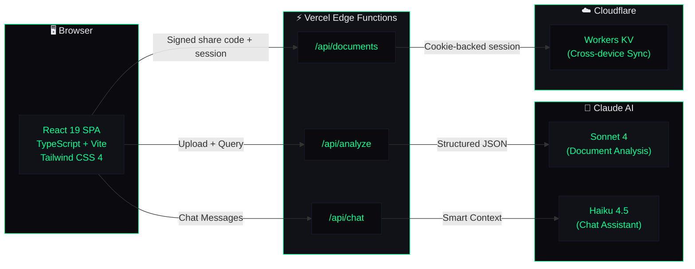

<div align="center">

<!-- Animated header banner -->


<!-- Animated typing subtitle -->
<a href="https://clear-desk-ten.vercel.app">
  
</a>

<br/>

<!-- Badges -->
[](https://clear-desk-ten.vercel.app)
[](https://clear-desk-ten.vercel.app)
[](LICENSE.txt)

<br/>

<!-- Tech stack icons -->


<br/><br/>

<!-- Priority visualization -->
```
 🔴 CRITICAL    🟠 HIGH    🟡 MEDIUM    🟢 LOW
 ████████████   ████████   ██████████   ████████████
 $50k+ overdue  Past due   Approaching  Current
```

</div>

---

<div align="center">
<table>
<tr>
<td align="center" width="25%">

**📄 7 Formats**<br/>
<sub>PDF · Image · Word · Excel · CSV · Email · Text</sub>

</td>
<td align="center" width="25%">

**🌐 2 Languages**<br/>
<sub>English + Spanish summaries — automatic</sub>

</td>
<td align="center" width="25%">

**💬 AI Chat**<br/>
<sub>Ask questions about your entire AR queue</sub>

</td>
<td align="center" width="25%">

**⚡ Real-time**<br/>
<sub>Upload → Structured data in seconds</sub>

</td>
</tr>
</table>
</div>

---

## The Problem

> RPA bots execute defined workflows flawlessly and **fail silently on anything unexpected** — a misformatted invoice, a missing field, an ambiguous collections dispute. The result is a human bottleneck at exactly the point where speed matters most.

ClearDesk handles the messy middle. It processes the documents your bots would choke on, structures the output your bots can consume cleanly, and surfaces the judgment calls your team actually needs to make.

---

## Features

<details open>
<summary><h3>📄 Document Processing</h3></summary>

Upload any AR document — PDF, image, Word, Excel, CSV, email, or plain text. Claude AI analyzes each one and returns:

| Output | Description |
|:---|:---|
| 🏷️ Classification | Invoice, statement, payment confirmation, dispute, credit note |
| 🔍 Entity Extraction | Customer name, invoice number, amounts, dates, payment terms, account numbers |
| 🎯 Priority Scoring | `CRITICAL` / `HIGH` / `MEDIUM` / `LOW` based on configurable dollar thresholds |
| 📅 Action Deadline | The single most important date from the document |
| 📊 Confidence Score | How certain the AI is about its extraction |
| 🚨 Escalation Flags | Specific reasons with severity levels — blocking, warning, informational |

</details>

<details open>
<summary><h3>🌐 Multilingual Summaries</h3></summary>

Every document generates a 3-sentence summary in both **English and Spanish** simultaneously. No extra steps, no separate translation feature — it's automatic.

```
┌─────────────────────────────────────────────────────────┐
│  EN │ Swift Haul owes $12,450 on Invoice #4892.         │
│     │ Payment was due Feb 15. Account is 45 days past   │
│     │ due with no payment activity recorded.             │
├─────┼───────────────────────────────────────────────────┤
│  ES │ Swift Haul debe $12,450 en la Factura #4892.      │
│     │ El pago venció el 15 de febrero. La cuenta tiene  │
│     │ 45 días de atraso sin actividad de pago.          │
└─────────────────────────────────────────────────────────┘
```

Built for teams operating across the US, Mexico, Colombia, and Latin America.

</details>

<details open>
<summary><h3>💬 AI Chat Assistant</h3></summary>

A conversational AI assistant (Claude Haiku) that knows your entire document queue:

- 📋 Ask what needs attention today
- 🚨 Get a summary of all escalated items
- ⏰ Find out who's most overdue
- ✉️ Draft collections follow-up emails ready to send
- 💡 Get operational recommendations

**Smart context injection** — the assistant only receives documents relevant to your question, not your entire queue. Ask about escalated items and it only sees escalated documents. Mention a customer name and it only sees that customer's files.

</details>

<details>
<summary><h3>📊 Team Dashboard</h3></summary>

Every processed document surfaces as a card with priority, status, and key data visible at a glance. Filter by:

- Status: `Pending` → `Processing` → `In Review` → `Completed` → `Escalated`
- Priority: `Critical` / `High` / `Medium` / `Low`
- Document type · Assignee · Free-text search

</details>

<details>
<summary><h3>⚡ Configurable Escalation Logic</h3></summary>

Set your own rules for what gets flagged:

```
┌──────────────────────────────────────────────────┐
│  RULE                          │  TRIGGER        │
├────────────────────────────────┼─────────────────┤
│  All disputes                  │  Auto-escalate  │
│  AI confidence < 80%           │  Review flag    │
│  Amount > critical threshold   │  Alert          │
│  Due date within 7 days        │  Urgent         │
└──────────────────────────────────────────────────┘
```

Each escalation includes the specific reason, the field that triggered it, and a severity level — not a generic alert.

</details>

<details>
<summary><h3>🔄 Cross-Device Sync &nbsp;·&nbsp; 📤 Export &nbsp;·&nbsp; 🎨 Theming</h3></summary>

- **Sync** — Generate a short-lived signed share code to access your documents on another browser. Powered by Cloudflare KV.
- **Export** — Generate summary reports of your current filtered view for standups or downstream systems.
- **Themes** — Dark, Light, and System modes. Dark theme: `#0A0A0F` bg, `#00FF94` accent, Syne + DM Sans + JetBrains Mono.

</details>

---

## Supported Formats

<div align="center">

| Format | Engine | Status |
|:---:|:---:|:---:|
| `PDF` | pdfjs-dist | 🟢 |
| `PNG` `JPG` `WEBP` | tesseract.js (OCR) | 🟢 |
| `DOCX` | mammoth | 🟢 |
| `XLSX` `CSV` | xlsx | 🟢 |
| `EML` | Native parser | 🟢 |
| `TXT` `JSON` `MD` | Direct read | 🟢 |

</div>

---

## Architecture



<details>
<summary>📡 API Routes</summary>

| Route | Method | Purpose |
|:---|:---:|:---|
| `/api/analyze` | `POST` | Document analysis via Claude Sonnet — structured JSON with dual-language summaries |
| `/api/chat` | `POST` | Conversational AI via Claude Haiku — chat history + smart context injection |
| `/api/documents` | `GET/PUT/POST` | Cross-device sync via Cloudflare KV with signed share codes |

</details>

<details>
<summary>🔒 Security</summary>

- API keys are server-side only via Vercel environment variables
- UUID v4 validation on all sync endpoints
- Content length guards (50k char max) prevent abuse
- No user data stored server-side except optional KV sync
- Prompt caching reduces API costs up to 90% on repeated system prompts

</details>

---

## Quick Start

```bash
git clone https://github.com/Senpai-Sama7/ClearDesk.git
cd ClearDesk
npm install
```

Create `.env.local`:

```env
ANTHROPIC_API_KEY=your_key_here
```

```bash
npm run dev
# → http://localhost:5173
```

<details>
<summary>🔧 Environment Variables</summary>

| Variable | Required | Description |
|:---|:---:|:---|
| `ANTHROPIC_API_KEY` | ✅ | Anthropic API key — server-side only |
| `CLOUDFLARE_ACCOUNT_ID` | ➖ | Enables cross-device sync |
| `CLOUDFLARE_KV_NAMESPACE_ID` | ➖ | Enables cross-device sync |
| `CLOUDFLARE_API_TOKEN` | ➖ | Workers KV Storage: Edit permission |
| `CLEARDESK_SYNC_SECRET` | ➖ | Signs sync session cookies and short-lived share codes |

If the Cloudflare sync variables are not set, the app keeps working with browser-local document storage only.

</details>

---

## Roadmap

- [ ] **RPA Integration Endpoint** — `/api/process` for UiPath or any automation platform
- [ ] **Webhook support** — push escalation flags to Slack, Teams, or email
- [ ] **Batch processing** — queue and process high document volumes async
- [ ] **Portuguese summaries** — third language for Brazilian AR operations
- [ ] **Role-based views** — different layouts for managers vs. processors

---

## Why This Exists

Built to demonstrate a specific architecture: **Claude as the judgment layer inside an accounting automation stack.** Not a mockup, not a concept — a working tool you can test against a real collections document on day one.

If something breaks, that's useful information. File an issue or reach out directly.

---

<div align="center">

### Contact

**Douglas Mitchell**

[](https://douglasmitchell.info)
[](https://github.com/Senpai-Sama7)
[](mailto:DouglasMitchell@ReliantAI.org)

<br/>

<sub>Proprietary · See <a href="LICENSE.txt">LICENSE.txt</a></sub>

<br/>

<!-- Animated footer wave -->


</div>
