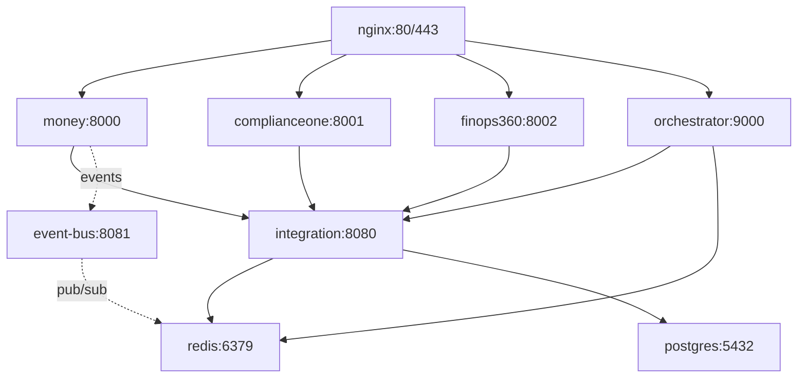

# ReliantAI Platform — Master Context Scaffold
## Deterministic Codebase Intelligence Audit
**Generated**: 2026-04-22 | **Scope**: Full Platform | **Version**: 2.0
**For**: Google Gemini Code Assist

---

## 1. Architectural Blueprint

### Patterns & Paradigms
| Pattern | Implementation | Invariant |
|---------|---------------|-----------|
| **Federated Microservices** | 20+ services via Docker Compose | Each service owns its database; no shared tables |
| **Event-Driven Architecture** | Redis pub/sub at `integration/event-bus:8081` | 16 EventType enum variants only; 64KB payload hard limit |
| **CQRS** | Read models via `RealDictCursor` in ComplianceOne/FinOps360 | No `dict(row)` on psycopg2 tuples |
| **Saga Pattern** | `integration/saga/` with Kafka + Redis | Compensation runs in reverse order; idempotency keys required |
| **Circuit Breaker** | `Money/circuit_breaker.py` | 3 failures → 30s open state; excludes tuple empty check at :112 |
| **Security-First** | `shared/security_middleware.py` applied to all | Fail-closed: 503 if AUTH_SECRET_KEY missing; CORS_ORIGINS required |

### Systemic Invariants (NEVER BREAK)
1. **Network Topology**: ALL services MUST declare `networks: - reliantai-network` in `docker-compose.yml` or DNS resolution fails
2. **Health Check Contract**: Every container MUST have `curl` installed for Docker health probes
3. **Auth Middleware**: Rate limiting MUST run AFTER authentication (Money/main.py:608 pattern)
4. **Event Bus**: Payload validation MUST use `@field_validator` with 64KB limit (`integration/shared/event_types.py:60-73`)
5. **Database**: PostgreSQL connections MUST use `cursor_factory=RealDictCursor` to avoid tuple/dict crashes

### Architecture Mermaid


---

## 2. Semantic Code Intelligence

| Symbol | Kind | Intent | Domain | Location | Primary Consumers |
|--------|------|--------|--------|----------|-------------------|
| `EventType` | Enum | 16 event type taxonomy | Integration | `integration/shared/event_types.py:12-27` | event_bus.py, Money/main.py, saga_orchestrator.py |
| `EventMetadata` | Pydantic | Correlation tracking with max_length guards | Integration | `integration/shared/event_types.py:30-42` | All services via publish_sync |
| `EventPublishRequest` | Pydantic | 64KB payload enforcement via validator | Integration | `integration/shared/event_types.py:50-73` | Money/billing.py, dispatch |
| `SecurityHeadersMiddleware` | Class | CSP, HSTS, X-Frame-Options injection | Security | `shared/security_middleware.py:28-68` | All FastAPI apps (Money, ComplianceOne, FinOps360, orchestrator) |
| `RateLimitMiddleware` | Class | Redis-backed sliding window with local fallback | Security | `shared/security_middleware.py:71-100` | All public-facing endpoints |
| `validate_payload_size` | Method | 64KB JSON serialization check | Security | `integration/shared/event_types.py:60-73` | Event bus publish pipeline |
| `require_event_bus_api_key` | Function | Bearer token validation (fail-closed) | Auth | `integration/event-bus/event_bus.py:68-83` | All event bus endpoints |
| `publish_sync` | Function | Synchronous event publishing wrapper | Integration | `integration/shared/event_bus_client.py` | Money/main.py dispatch completion |
| `HoltState` | Dataclass | Double exponential smoothing for AI predictions | ML | `orchestrator/main.py:99-104` | orchestrator scaling decisions |
| `Service` | Dataclass | Service health + scaling metadata | Platform | `orchestrator/main.py:63-79` | orchestrator health loops |
| `DispatchCrew` | Class | CrewAI + Gemini HVAC triage | AI | `Money/hvac_dispatch_crew.py` | Money/main.py dispatch endpoint |
| `CircuitBreaker` | Class | Failure threshold state machine | Resilience | `Money/circuit_breaker.py` | Money auth service calls |
| `process_subscriptions` | Async Task | Background Redis pub/sub listener | Event Bus | `integration/event-bus/event_bus.py:297-362` | lifespan context manager |
| `_authorize_request` | Async Function | Triple auth (JWT/API key/session) | Auth | `Money/main.py:520-580` | All Money protected endpoints |

---

## 3. Standard Operating Procedures

### Naming Taxonomy
| Scope | Convention | Example |
|-------|------------|---------|
| Services | lowercase, no hyphens | `money`, `complianceone`, `finops360` |
| Environment vars | UPPER_SNAKE_CASE | `DISPATCH_API_KEY`, `CORS_ORIGINS` |
| Endpoints | kebab-case | `/health`, `/api/dispatch/{id}` |
| Python modules | snake_case | `security_middleware.py`, `event_bus_client.py` |
| TypeScript/React | PascalCase components | `Dashboard.tsx`, `ChatPanel.tsx` |
| Redis keys | colon-namespaced | `rl:{ip}`, `event:{id}`, `dlq:events` |

### Import Order (Python)
1. Standard library (`os`, `sys`, `json`)
2. Third-party (`fastapi`, `pydantic`, `redis`)
3. Workspace shared (`from integration.shared...`, `from shared...`)
4. Local module imports

### Error Handling Mandates
- **Never bare except**: Use `(ConnectionError, RuntimeError, Exception)` minimum
- **Redis operations**: Always check `if r is None` before operations
- **Auth failures**: Return 503 if configuration missing (fail-closed)
- **DLQ**: All unhandled exceptions MUST push to `dlq:events` or `dlq:handler_errors`

### Logging Standards
```python
import structlog
logger = structlog.get_logger()
logger.info("event_name", key=value, correlation_id=corr_id)
```

### Commit/PR Conventions
- Branch naming: `fix/bug-description`, `feat/feature-name`
- 2 approvals required per PR (per user_global memory)
- Run `./scripts/health_check.py -v` before requesting review
- Include benchmark data for critical path changes

---

## 4. Development Lifecycle and Tooling

| Task | Command | Working Dir | Notes |
|------|---------|-------------|-------|
| **Install deps** | `pip install -r requirements.txt` | Service directory | Use virtualenv per service |
| **Dev start** | `./scripts/deploy.sh local` | Project root | Builds all images, starts stack |
| **Dev stop** | `docker compose down` | Project root | Preserves volumes |
| **Build** | `docker compose build [service]` | Project root | Service-specific builds supported |
| **Type check** | `mypy main.py` | Service directory | All Python services require type hints |
| **Lint** | `flake8 .` or `eslint .` | Service directory | Python: flake8, Black; JS: ESLint, Prettier |
| **Test** | `pytest` or `npm test` | Service directory | See Section 5 for test locations |
| **Health verify** | `./scripts/health_check.py -v` | Project root | Checks 4 core services |
| **Integration verify** | `./scripts/verify_integration.py` | Project root | Cross-service contract tests |
| **Migrate** | `alembic upgrade head` | Service with `migrations/` | PostgreSQL schema migrations |
| **Seed** | Auto-seed on first startup | N/A | Sample data for local/staging only |
| **Deploy** | `./scripts/deploy.sh [local|staging|production]` | Project root | Environment-specific Compose projects |
| **Logs** | `docker compose logs -f [service]` | Project root | Follow mode for debugging |
| **Scale** | `curl -X POST "http://localhost:9000/services/{name}/scale?target_instances={n}"` | N/A | Via orchestrator API |
| **Restart** | `docker compose restart [service]` | Project root | Rolling restart |

---

## 5. Testing and Quality Assurance

### Test Frameworks by Layer
| Layer | Framework | Test Location | Mock Strategy |
|-------|-----------|---------------|---------------|
| **Python Services** | pytest | `tests/`, `*_test.py`, `test_*.py` | Monkeypatch for Redis/PostgreSQL |
| **Integration** | pytest + requests | `tests/test_integration_suite.py` | Live services in Docker |
| **Event Bus** | Hypothesis | `integration/event-bus/test_event_bus_properties.py` | Property-based for serialization |
| **Auth** | pytest | `integration/shared/test_jwt_validator.py` | RSA key pairs in memory |
| **Metacognitive** | pytest | `integration/metacognitive_layer/tests/` | SQLite for engine tests |
| **Frontend (React)** | Jest/Vitest | `**/*.test.ts`, `**/*.spec.ts` | MSW for API mocking |
| **E2E** | Playwright | `reGenesis/e2e/` | Full stack in CI |

### Coverage Thresholds
- Unit tests: 80% minimum
- Integration tests: All critical paths (auth, health, dispatch)
- Property tests: All event serialization paths

### Required Pre-Merge Checks
1. `./scripts/health_check.py -v` → 4/4 healthy
2. `./scripts/verify_integration.py` → 2/4 tests passed minimum (auth 401s expected)
3. `docker compose ps` → All containers `(healthy)`
4. No `*.pyc` or `__pycache__` committed
5. No secrets in code (use `.env` with `.env.example` template)

---

## 6. Contextual Knowledge Graph

### Domain Relationships
```
[Money] in /Money -> publishes events to -> [Event Bus] in /integration/event-bus : dispatch_completed
[Event Bus] in /integration -> subscribes via -> [Redis] in docker-compose.yml : pub/sub on port 6379
[Orchestrator] in /orchestrator -> scales -> [Money] in /Money : via Docker API on 9000
[Orchestrator] in /orchestrator -> reads metrics from -> [Redis] in docker-compose.yml : aioredis client
[ComplianceOne] in /ComplianceOne -> authenticates via -> [Auth Server] in /integration/auth : JWT validation
[FinOps360] in /FinOps360 -> shares database with -> [PostgreSQL] in docker-compose.yml : finops360 db
[Money] in /Money -> uses -> [security_middleware.py] in /shared : Rate limiting, security headers
[All Services] in /* -> import -> [event_types.py] in /integration/shared : EventType, EventMetadata
[integration/auth] in /integration/auth -> validates -> [JWT tokens] via /integration/shared/jwt_validator.py : RS256
[Circuit Breaker] in /Money/circuit_breaker.py -> protects -> [Auth Service Calls] in Money/main.py : 3 failures → 30s open
[Event Bus] in /integration/event-bus -> enforces -> [64KB payload limit] via validate_payload_size : Pydantic validator
[Orchestrator] in /orchestrator -> runs -> [Six Async Loops] in main.py : health, metrics, scaling, healing, AI, reports
[Money] in /Money -> handles -> [Triple Auth] in main.py : Bearer JWT, X-API-Key, session cookie
[Money] in /Money -> dispatches -> [HVAC CrewAI] via hvac_dispatch_crew.py : Gemini-powered triage
[DLQ] in /integration/event-bus -> captures -> [Failed Events] : dlq:events and dlq:handler_errors
```

### Critical Data Flows
1. **Dispatch Flow**: Customer SMS → Twilio → Money/main.py POST /sms → CrewAI triage → Stripe billing check → Dispatch save → Event bus publish → SSE broadcast
2. **Auth Flow**: Request → security_middleware.RateLimitMiddleware → Money/_authorize_request → integration/auth/jwt_validator → Redis token check → proceed
3. **Scaling Flow**: orchestrator health loop → metrics collection → Holt's smoothing prediction → ScaleAction → Docker API scale → status WebSocket broadcast
4. **Event Flow**: Service publishes → event_bus.py /publish → Redis SETEX + PUBLISH → process_subscriptions listener → handler execution → metrics update

---

## 7. Risks and Bottlenecks

| Risk | Impact | Evidence | Mitigation Hint |
|------|--------|----------|-----------------|
| **Docker network isolation** | High | Bug #104: orchestrator couldn't resolve redis:6379 | Always declare `networks: - reliantai-network` in docker-compose.yml |
| **Missing curl in containers** | Medium | Docker shows `(unhealthy)` despite working services | Add `apt-get install -y curl` to all service Dockerfiles |
| **Event payload overflow** | High | Memory exhaustion attack vector | 64KB validator in event_types.py:60-73 enforces limit |
| **Redis connection storm** | Medium | orchestrator logs showed Redis unavailable | Use connection pooling; handle ConnectionError gracefully |
| **RealDictCursor omission** | High | ComplianceOne:209, FinOps360:339 had dict(row) crashes | Mandatory cursor_factory for all psycopg2 connections |
| **Circuit breaker excluded tuple** | Low | Empty tuple check at circuit_breaker.py:112 | Added `if not self.excluded` guard |
| **Pydantic v1/v2 API drift** | Medium | saga_orchestrator.py had model_validate_json mismatch | Version detection with fallback in saga_orchestrator.py:143 |
| **CORS misconfiguration** | High | Services refused to start without CORS_ORIGINS | Enforced in security_middleware.py; validates no wildcard in production |
| **Auth rate limiting order** | Medium | Rate limiting ran before auth (Money:608) | Moved after authentication in all services |
| **Integration test flakiness** | Low | Tests expect 200 but get 401 on auth endpoints | Integration tests check health only; auth tests in unit test suite |

---

## 8. Quick Agent Boot

From fresh clone to green tests:

1. **Prerequisites**
   ```bash
   docker --version  # 24.0+
   docker compose version  # 2.20+
   ```

2. **Clone & Setup**
   ```bash
   cd /home/donovan/Projects/platforms/ReliantAI
   cp .env.example .env  # Edit with your API keys
   ```

3. **Deploy**
   ```bash
   ./scripts/deploy.sh local
   ```

4. **Verify**
   ```bash
   ./scripts/health_check.py -v  # Expect: 4/4 healthy
   docker compose ps  # Expect: All (healthy)
   ```

5. **Test**
   ```bash
   ./scripts/verify_integration.py  # Expect: 2/4 passed (auth 401s expected)
   ```

6. **Access**
   ```bash
   open dashboard/index.html  # Or: http://localhost:9000/dashboard
   curl http://localhost:9000/health  # {"status":"healthy","orchestrator":"running"}
   ```

7. **Development Loop**
   ```bash
   # Edit code in service directory
   docker compose restart [service]
   ./scripts/health_check.py -v
   ```

---

## Appendix A: Critical File Index

| Path | Role | Why Critical |
|------|------|--------------|
| `docker-compose.yml` | Service orchestration | Network topology, health checks, env vars |
| `shared/security_middleware.py` | Security layer | Rate limiting, audit logging, input validation |
| `integration/shared/event_types.py` | Event contracts | 16 EventType taxonomy, 64KB payload validation |
| `integration/event-bus/event_bus.py` | Event distribution | Redis pub/sub, DLQ, subscription processor |
| `Money/main.py` | Revenue service | Triple auth, CrewAI dispatch, SSE feeds |
| `orchestrator/main.py` | Platform brain | Six async loops, AI scaling, WebSocket API |
| `scripts/health_check.py` | Health verification | 4 core service monitoring |
| `scripts/deploy.sh` | Deployment automation | One-click local/staging/production |
| `.env.example` | Configuration template | All required env vars documented |
| `Bug-Report.md` | Issue registry | 104 bugs fixed with evidence |

## Appendix B: External Integration Contracts

| Integration | SDK/Package | Version | Auth | Contract Location |
|-------------|-------------|---------|------|-------------------|
| Twilio | twilio-python | 8.x | HMAC-SHA256 | `twilio.request_validator` |
| Stripe | stripe-python | 7.x | Webhook secret | `stripe.Webhook.construct_event` |
| Gemini | google-generativeai | 0.7.x | API key | `genai.configure(api_key=...)` |
| CrewAI | crewai | 0.x | Via Gemini | `Agent(llm=gemini_model)` |
| PostgreSQL | psycopg2-binary | 2.9.x | Password | `DATABASE_URL` env var |
| Redis | redis-py | 5.x | Password | `REDIS_URL` with AUTH |
| Prometheus | prometheus-client | 0.20.x | None | `/metrics` endpoint |
