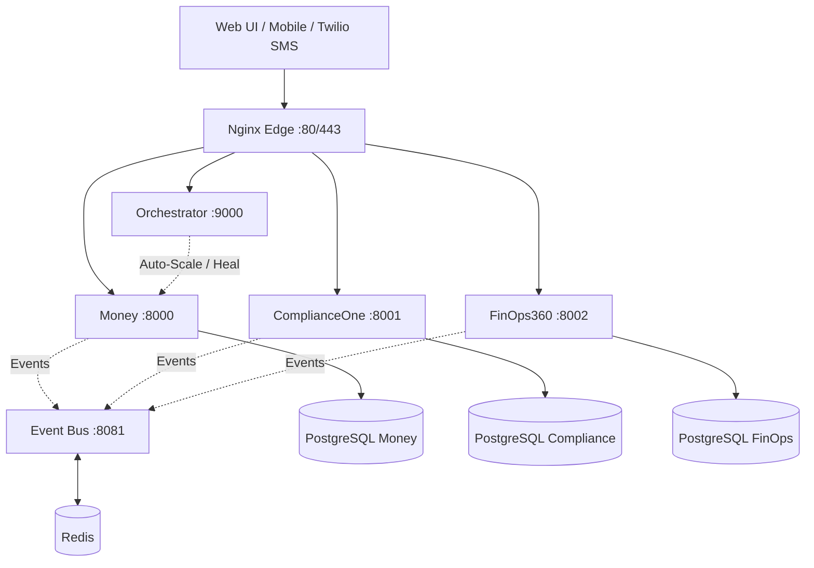

<div align="center">
  <h1>🚀 ReliantAI Platform</h1>
  <p><b>Autonomous, Self-Managing, AI-Powered Enterprise Microservices Platform</b></p>

  [](https://opensource.org/licenses/MIT)
  []()
  []()
  []()
</div>

---

## 📖 Overview

ReliantAI is a cutting-edge, federated multi-service platform built around a central integration nervous system. It seamlessly combines real-world business operations (like automated HVAC dispatching) with enterprise SaaS analytics, strict compliance enforcement, cloud cost management, and a multi-tier AI agent framework. 

The entire platform is wired through a shared authentication layer, a resilient event bus, and saga coordination—enabling a truly autonomous system that auto-scales, self-heals, and routes tasks to specialized AI agents.

---

## ✨ Core Features & Services

ReliantAI is composed of **20+ integrated microservices**. Here are the pillars of the platform:

### 💼 Business Operations
* **Money Service**: The revenue engine. Handles real-world HVAC dispatching, automated SMS triage (via Twilio), AI-powered job assignment (via CrewAI + Gemini), and Stripe billing.
* **Gen-H**: High-conversion lead generation and templating library for home services.
* **Citadel Ultimate A+**: Advanced market intelligence and census data ranking.

### 🛡️ Enterprise SaaS & Governance
* **ComplianceOne**: Automated compliance tracking for SOC2, HIPAA, PCI-DSS, and GDPR.
* **FinOps360**: Multi-cloud cost optimization, right-sizing recommendations, and anomaly detection.
* **Ops-Intelligence**: Comprehensive operational analytics and dashboarding.
* **BackupIQ**: Automated disaster recovery, snapshotting, and data lifecycle management.

### 🧠 AI & Autonomy
* **Orchestrator**: The "Platform Brain". Runs 6 asynchronous loops to continuously monitor health, collect metrics, and autonomously scale containers using Holt-Winters forecasting and Docker APIs.
* **Apex Framework**: A multi-tier AI agent ecosystem featuring UI, Agents, and Model Context Protocol (MCP) integrations.

### 🔌 Infrastructure & Integration
* **Integration Layer**: Features an Event Bus (Redis Pub/Sub), Saga Orchestrator for distributed transactions, and unified JWT Authentication.
* **Edge Routing**: Nginx reverse proxy with TLS termination, rate limiting, and strict security headers.
* **Data Storage**: PostgreSQL databases (isolated per service) and Redis caching.

---

## 🏗️ Architecture



*Note: Each service is fully isolated, enforcing CQRS and event-driven patterns. Mocks are strictly forbidden; all services interact with real external APIs or fail gracefully.*

---

## 🚀 Quickstart

### Prerequisites
* Docker (24.0+)
* Docker Compose (2.20+)
* Python 3.11+ (for local scripts)

### 1. Setup Environment
Clone the repository and initialize the configuration:
```bash
git clone https://github.com/your-org/ReliantAI.git
cd ReliantAI
cp .env.example .env
```
*Note: The `.env.example` comes pre-configured with safe local defaults so `docker compose config` passes out of the box. For real AI/SMS functionality, fill in `GEMINI_API_KEY`, `TWILIO_SID`, etc., in your `.env` file.*

### 2. Deploy Locally
Use the automated deployment script to spin up the entire stack:
```bash
./scripts/deploy.sh local
```

### 3. Verify Health
Check that all 20+ containers are running and healthy:
```bash
./scripts/health_check.py -v
```

### 4. Access the Platform
* **Dashboard**: [http://localhost/dashboard](http://localhost/dashboard) (or `open dashboard/index.html`)
* **API Gateway**: `http://localhost:80`
* **Orchestrator**: `http://localhost:9000`

---

## 📚 Documentation

For a deep dive into every service, API contracts, deployment strategies, and troubleshooting, please read the **[User Manual](./USER_MANUAL.md)**.

Additional documentation:
* `AGENTS.md` - AI Agent behaviors and capabilities
* `MASTER_AUDIT_CONSOLIDATED.md` - Audit history and security posture
* `docs/runbooks/` - Operational runbooks and incident response

---

## 🔒 Security & Compliance

ReliantAI enforces strict "Fail-Closed" security policies:
- **Zero Mocks**: All API endpoints interface with real dependencies or error out safely.
- **Triple Auth**: Endpoints support JWT Bearer, X-API-Key, and Session cookies.
- **Payload Validation**: Hard limits (e.g., 64KB) on Event Bus payloads.
- **Circuit Breakers**: Protect against cascading failures when calling external APIs.

---

## 🤝 Contributing

We follow standard Git-flow. Ensure you run static analysis and tests before submitting PRs:
```bash
flake8 .
pytest
./scripts/verify_integration.py
```

<div align="center">
  <i>Built for the Future. Designed for Autonomy.</i>
</div>