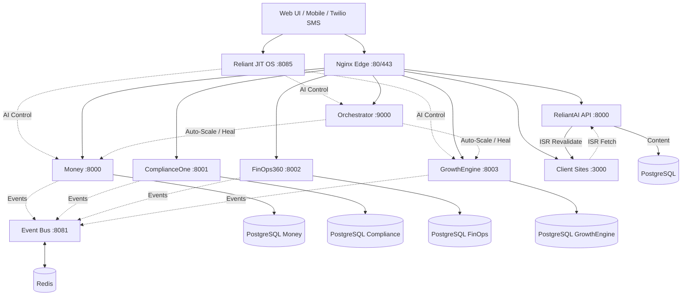

<div align="center">
  <h1>🚀 ReliantAI Platform</h1>
  <p><b>Autonomous, Self-Managing, AI-Powered Enterprise Microservices Platform</b></p>

  [](https://opensource.org/licenses/MIT)
  []()
  []()
  []()
  []()
</div>

---

## 📖 Overview

ReliantAI is a cutting-edge, federated multi-service platform built around a central integration nervous system. It seamlessly combines real-world business operations (like automated HVAC dispatching) with enterprise SaaS analytics, strict compliance enforcement, cloud cost management, and a multi-tier AI agent framework.

The entire platform is wired through a shared authentication layer, a resilient event bus, and saga coordination—enabling a truly autonomous system that auto-scales, self-heals, and routes tasks to specialized AI agents.

### 🆕 Introducing: Reliant JIT OS v2.0

**Zero-Configuration Operations System**

Reliant JIT OS eliminates manual configuration entirely. No `.env` files. No documentation to read. Just open your browser, enter your API keys through the secure wizard, and the system configures itself. The built-in AI can:

- Answer questions about any service
- Write and deploy code modifications
- Find leads and send SMS pitches
- Monitor and heal the platform
- Generate compliance and cost reports

**Access:** http://localhost:8085 (after `docker compose up`)

---

## ✨ Core Features & Services

ReliantAI is composed of **20+ integrated microservices**. Here are the pillars of the platform:

### 💼 Business Operations
* **ReliantAI API**: FastAPI + Celery platform core. Handles prospects, site registration, and background task pipeline (GBP scraping → site generation → schema submission → review monitoring).
* **ReliantAI Client Sites**: Next.js App Router with ISR. Dynamically generates branded landing pages for home service businesses at `/[slug]`. One shared app, no per-site builds.
* **Money Service**: The revenue engine. Handles real-world HVAC dispatching, automated SMS triage (via Twilio), AI-powered job assignment (via CrewAI + Gemini), and Stripe billing.
* **GrowthEngine**: Autonomous lead generation using Google Places API. Finds home service businesses, filters by quality, and sends personalized SMS pitches.
* **Gen-H**: High-conversion lead generation and templating library for home services.
* **Citadel Ultimate A+**: Advanced market intelligence and census data ranking.

### 🛡️ Enterprise SaaS & Governance
* **ComplianceOne**: Automated compliance tracking for SOC2, HIPAA, PCI-DSS, and GDPR.
* **FinOps360**: Multi-cloud cost optimization, right-sizing recommendations, and anomaly detection.
* **Ops-Intelligence**: Comprehensive operational analytics and dashboarding.
* **BackupIQ**: Automated disaster recovery, snapshotting, and data lifecycle management.

### 🧠 AI & Autonomy
* **Orchestrator**: The "Platform Brain". Runs 6 asynchronous loops to continuously monitor health, collect metrics, and autonomously scale containers using Holt-Winters forecasting and Docker APIs.
* **Apex Framework**: A comprehensive suite for deploying, managing, and interacting with AI agents.
* **Reliant JIT OS**: Zero-configuration AI operations system with multi-role assistant (Auto, Support, Engineer, Sales modes).

### 🔌 Infrastructure & Integration
* **Integration Layer**: Features an Event Bus (Redis Pub/Sub), Saga Orchestrator for distributed transactions, and unified JWT Authentication.
* **Edge Routing**: Nginx reverse proxy with TLS termination, rate limiting, and strict security headers.
* **Data Storage**: PostgreSQL databases (isolated per service) and Redis caching.

---

## 🏗️ Architecture



*Note: Each service is fully isolated, enforcing CQRS and event-driven patterns. Mocks are strictly forbidden; all services interact with real external APIs or fail gracefully.*

---

## 🚀 Quickstart

### Prerequisites
* Docker (24.0+)
* Docker Compose (2.20+)
* Python 3.11+ (for local scripts)
* Node.js 18+ (for client sites development)

### Option 1: Zero-Configuration (JIT OS)

The easiest way to get started — no `.env` editing required:

```bash
# Clone and start everything
git clone https://github.com/your-org/ReliantAI.git
cd ReliantAI

# Start the entire platform
docker compose up -d

# Or start just the JIT OS
docker compose up -d reliant-os-backend reliant-os-frontend
```

Then open **http://localhost:8085** and follow the setup wizard.

### Option 2: Traditional Setup (with .env)

For advanced users who prefer manual configuration:

```bash
# 1. Setup environment variables
cp .env.example .env
# Edit .env with your API keys

# 2. Run the deployment script
./scripts/deploy.sh local

# 3. Verify Health
./scripts/health_check.py -v
```

### 3. Access the Platform

| Service | URL | Purpose |
|---------|-----|---------|
| Reliant JIT OS | http://localhost:8085 | AI-powered operations control |
| Dashboard | http://localhost | Main platform dashboard |
| Money API | http://localhost:8000 | Billing & dispatch |
| GrowthEngine | http://localhost:8003 | Lead generation |
| Orchestrator | http://localhost:9000 | System monitoring |

---

## 🤖 Using the JIT OS AI

Once the platform is running, the JIT OS provides a chat interface to control everything:

### Example Commands

**System Operations:**
```
"Show me system status"
"Scale up the Money service to handle more load"
"What errors occurred in the last hour?"
```

**Code Modifications:**
```
"Add a refund endpoint to Money service"
"Fix the healthcheck in the dashboard"
"Update pricing tiers for enterprise customers"
```

**Lead Generation:**
```
"Find HVAC companies in Atlanta with 4+ stars"
"Search for plumbing services without websites"
"Generate and send SMS pitches to top 5 leads"
```

**Support Questions:**
```
"How does the event bus work?"
"What's the difference between ComplianceOne and FinOps360?"
"How do I add a new microservice?"
```

See `reliant-os/USER_MANUAL.md` for complete usage guide.

---

## 📊 Service Overview

| Service | Port | Purpose | AI-Controllable |
|---------|------|---------|-----------------|
| Reliant JIT OS | 8085 | Zero-config AI operations | N/A (Controller) |
| Money | 8000 | Billing, SMS, dispatch | ✅ Yes |
| GrowthEngine | 8003 | Lead generation | ✅ Yes |
| ComplianceOne | 8001 | SOC2/HIPAA/GDPR compliance | ✅ Yes |
| FinOps360 | 8002 | Cloud cost optimization | ✅ Yes |
| Orchestrator | 9000 | Auto-scaling, healing | ✅ Yes |
| Dashboard | 80 | Visual analytics | ✅ Yes |
| Client Sites | 3000 | ISR landing pages (Next.js) | ✅ Yes |
| Event Bus | 8081 | Redis pub/sub messaging | ❌ Infrastructure |
| PostgreSQL | 5432 | Per-service databases | ❌ Infrastructure |
| Redis | 6379 | Caching & sessions | ❌ Infrastructure |

---

## 🛡️ Security

### Zero-Configuration Security Model

The JIT OS uses a **secure vault** instead of `.env` files:

- **AES-256 encryption** for all API keys
- **No plain text secrets** on disk
- **Subprocess sandboxing** for AI code execution
- **Blacklist validation** for dangerous commands
- **30-second timeout** on all code execution
- **Complete audit trail** with SHA-256 code hashes

### Traditional Security (for .env users)

All public endpoints are protected by `SecurityHeadersMiddleware` and `RateLimitMiddleware`.

1. Obtain a token via `POST /api/auth/login`.
2. Pass the token in the `Authorization: Bearer <token>` header.
3. Services validate the JWT locally using the public key provided by the Auth Service.

---

### 🏠 Client Sites (ISR-Generated Landing Pages)
* **ReliantAI Client Sites**: Next.js App Router with ISR rendering. Dynamically generates branded landing pages for home service businesses at `/[slug]`. Powered by the `ReliantAI` API (FastAPI + Celery). No per-site builds — all content served from a shared ISR cache refreshed on-demand via Celery tasks.

See `reliantai-client-sites/README.md` for full documentation.

---

## 📁 Project Structure

```
ReliantAI/
├── Money/                    # Revenue engine & dispatch
├── GrowthEngine/             # Autonomous lead generation
├── ComplianceOne/            # Compliance tracking
├── FinOps360/               # Cloud cost optimization
├── Orchestrator/            # Platform brain & auto-scaling
├── reliantai/               # 🆕 FastAPI platform core + CrewAI agents
│   ├── agents/             # CrewAI agents (GBP scraper, PageSpeed, SMS, email)
│   ├── api/v2/             # API endpoints (prospects, generated_sites, webhooks)
│   ├── celery_app.py        # Celery config with beat_schedule
│   ├── db/                  # SQLAlchemy models + Alembic migrations
│   └── services/            # Business logic (site_registration_service)
├── reliantai-client-sites/  # 🆕 Next.js ISR client sites (6 trade templates)
│   ├── app/[slug]/         # Dynamic ISR route at /[slug]
│   ├── components/         # Shared components (StatsBar, CTASection, TrustBanner)
│   ├── templates/           # 6 trade-specific templates
│   │   ├── hvac-reliable-blue/
│   │   ├── plumbing-trustworthy-navy/
│   │   ├── electrical-sharp-gold/
│   │   ├── roofing-bold-copper/
│   │   ├── painting-clean-minimal/
│   │   └── landscaping-earthy-green/
│   └── tests/e2e/           # Playwright E2E tests
├── integration/             # Event bus, auth, sagas
├── dashboard/               # Main web dashboard
├── reliant-os/              # 🆕 Zero-config AI operations
│   ├── backend/            # FastAPI + vault + AI engine
│   └── frontend/           # React chat interface
├── scripts/                 # Deployment & health checks
├── docker-compose.yml       # Full platform orchestration
└── README.md               # This file
```

---

## 🧪 Testing

```bash
# Run all health checks
./scripts/health_check.py -v

# Expected output:
# ✅ Money (8000): Healthy
# ✅ ComplianceOne (8001): Healthy
# ✅ FinOps360 (8002): Healthy
# ✅ Orchestrator (9000): Healthy
# ✅ GrowthEngine (8003): Healthy
# ✅ Reliant JIT OS (8085): Healthy

# Check specific service
curl http://localhost:8000/health
curl http://localhost:8085/health
```

---

## 📝 Documentation

| Document | Purpose | Audience |
|----------|---------|----------|
| `README.md` | This file — platform overview & quickstart | Everyone |
| `CLAUDE.md` | **Developer reference** — architecture, codebase intelligence, health status | Developers (especially Claude Code) |
| `USER_MANUAL.md` | Platform-wide service documentation & operations | Platform operators |
| `reliant-os/USER_MANUAL.md` | User guide for Reliant JIT OS | Non-technical operators |
| `AGENTS.md` | AI agent development guidelines | Agent developers |
| `GEMINI.md` | Gemini AI integration & configuration | AI/LLM developers |
| `CONTRIBUTING.md` | Contribution guidelines & development process | Contributors |
| `CHANGELOG.md` | Version history & release notes | Release managers |

**Start Here:** 
- **For Claude Code:** Read `CLAUDE.md` for architecture, codebase health, and development commands
- **For Operations:** Read `README.md` then `USER_MANUAL.md`
- **For Development:** Read `CLAUDE.md` then `CONTRIBUTING.md`

---

## 🤝 Contributing

We welcome contributions! Please see our contributing guidelines (coming soon) for details on:

- Code style (PEP 8 for Python, ESLint for JS)
- Commit message conventions
- Pull request process
- Testing requirements

---

## 📜 License

MIT License — see LICENSE file for details.

---

**ReliantAI Platform** — Autonomous Operations for the Real World  
**Version:** 2.0  
**Status:** Production Ready
