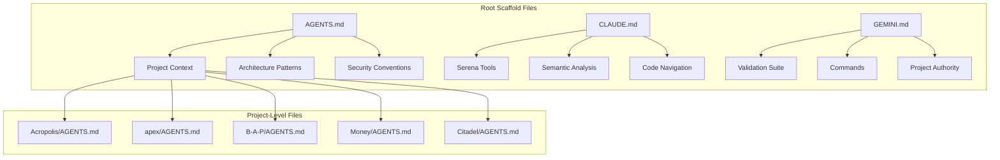

# ReliantAI Scaffold Files Analysis & Generation Plan

## Model Specification: Gemini 3.1 Flash Only

This plan is specifically optimized for **Google Gemini 3.1 Flash** as the sole AI model powering the scaffold generation. All context, instructions, and code analysis features are tailored for Gemini 3.1 Flash's capabilities.

## Current State Analysis

### Existing Scaffold Files at Root Level
| File | Purpose | Status |
|------|---------|--------|
| AGENTS.md | General AI agent context | ✅ Exists (3,870 chars) |
| CLAUDE.md | Claude-specific context | ✅ Exists (3,530 chars) |
| GEMINI.md | Gemini-specific context | ✅ Exists (5,921 chars) |

### Projects with Individual AGENTS.md Files
- Acropolis/AGENTS.md
- B-A-P/AGENTS.md
- BackupIQ/AGENTS.md
- Citadel/AGENTS.md
- ClearDesk/AGENTS.md
- CyberArchitect/AGENTS.md
- DocuMancer/AGENTS.md
- Gen-H/AGENTS.md
- Money/AGENTS.md
- apex/AGENTS.md
- citadel_ultimate_a_plus/AGENTS.md
- integration/AGENTS.md
- intelligent-storage/AGENTS.md
- reGenesis/AGENTS.md

## Plan Tasks

### Phase 1: Review Existing Root Scaffold Files

1. **Review AGENTS.md** - Verify:
   - Project list is up-to-date
   - Architecture patterns are accurate
   - Testing requirements are current
   - Security conventions are documented

2. **Review CLAUDE.md** - Verify:
   - Semantic analysis features are documented
   - Preferred commands are accurate
   - Project authority files are correct

3. **Review GEMINI.md** - Verify:
   - Navigation commands work
   - Validation suites are current
   - Serena configuration is documented

### Phase 2: Gap Analysis & Updates

4. **Identify Missing Projects** - Check if any new projects need scaffold files

5. **Verify Project References** - Ensure all projects have proper AGENTS.md or README.md

6. **Document Architecture Patterns** - Include:
   - Mermaid diagrams for complex workflows
   - Technology stack details
   - Integration points (MCP, webhooks, APIs)

### Phase 3: Semantic Code Analysis Features

7. **Document Code Analysis Tools** - Include:
   - Serena symbolic tools (find_symbol, find_referencing_symbols)
   - Ripgrep patterns for code search
   - Language-specific tooling (cargo, pytest, pnpm)

### Phase 4: Generate Updated Scaffold Files

8. **Update Root Scaffold Files** - As needed:
   - AGENTS.md - General context
   - CLAUDE.md - Claude-specific context  
   - GEMINI.md - Gemini-specific context

## Implementation Steps

## Implementation: Gemini 3.1 Flash Only

This plan is specifically optimized for **Google Gemini 3.1 Flash** as the sole AI model powering the scaffold generation. All context, instructions, and code analysis features are tailored for Gemini's capabilities.

### Gemini 3.1 Flash Optimization

- **Model**: Gemini 3.1 Flash (fast, efficient, large context window)
- **Use Case**: Scaffold generation for multi-project workspace
- **Focus**: Context-aware code analysis, architecture documentation

### Step 1: Review AGENTS.md
- [ ] Read current AGENTS.md content
- [ ] Compare with project structure
- [ ] Note any discrepancies

### Step 2: Review CLAUDE.md
- [ ] Read current CLAUDE.md content
- [ ] Verify Serena tool documentation
- [ ] Update command references

### Step 3: Review GEMINI.md
- [ ] Read current GEMINI.md content
- [ ] Verify validation commands
- [ ] Update navigation patterns

### Step 4: Gap Analysis
- [ ] List all projects in workspace
- [ ] Check each has AGENTS.md or README.md
- [ ] Note missing documentation

### Step 5: Generate Updates
- [ ] Update AGENTS.md with findings
- [ ] Update CLAUDE.md with findings
- [ ] Update GEMINI.md with findings

## Architecture Overview

## Key Documentation Requirements

### For Each Project, Document:
1. **Technology Stack** - Languages, frameworks, databases
2. **Build Commands** - How to build and test
3. **Architecture Pattern** - How the system works
4. **Integration Points** - APIs, MCP tools, webhooks
5. **Security Requirements** - Auth, secrets, validation
6. **Semantic Tools** - Available code analysis features

### Global Conventions to Maintain:
- No mocks in production (Rule 1)
- Project isolation (Rule 2)
- Hostile audit assumption (Rule 3)
- Verification before completion (Rule 4)

## Deliverables

1. **Updated AGENTS.md** - Comprehensive root context for all AI agents
2. **Updated CLAUDE.md** - Enhanced Claude-specific guidance  
3. **Updated GEMINI.md** - Enhanced Gemini-specific guidance
4. **Gap Report** - List of any missing documentation

## Success Criteria

- [ ] All three root scaffold files are consistent and up-to-date
- [ ] Each project has clear authority file reference
- [ ] Architecture patterns are documented with diagrams
- [ ] Semantic code analysis features are clearly explained
- [ ] Security and verification requirements are enforced

---

*Plan generated: 2026-03-10*
*Workspace: ReliantAI*
