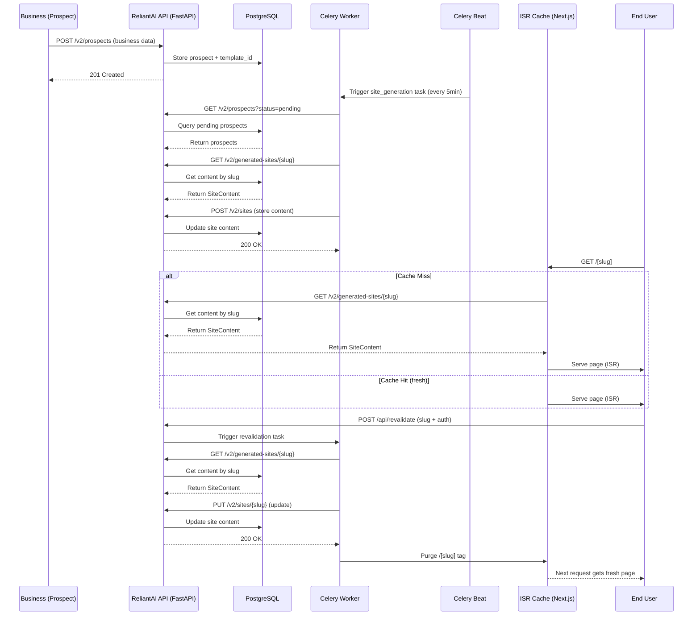

# ReliantAI Client Sites

ISR-powered landing page generator for home service businesses. Serves branded, trade-specific pages from a single Next.js app — no per-site builds.

## Architecture



Content flows: **Prospect created** → Celery task generates content → stored in DB → fetched at build time by Next.js → served as ISR page.

## Quick Start

```bash
cd reliantai-client-sites
npm install
cp .env.example .env  # fill in API_BASE_URL
npm run dev
```

Open [http://localhost:3000/hvac-reliable-cooling-austin](http://localhost:3000/hvac-reliable-cooling-austin) (sample slug).

## Development

```bash
npm run dev        # dev server
npm run build      # production build
npx tsc --noEmit  # typecheck
npm run test:e2e   # Playwright E2E tests
```

## Slug Format

`generate_slug(business_name, city)` — lowercase, hyphenated.

Example: "Reliable Cooling & Heating" in "Austin, TX" → `reliable-cooling-heating-austin`

## Templates

| ID | Trade | Accent | Theme |
|----|-------|--------|-------|
| `hvac` | HVAC | Blue | Dark, professional |
| `plumbing` | Plumbing | Blue | Dark, emergency-focused |
| `electrical` | Electrical | Amber | Dark, safety-first |
| `roofing` | Roofing | Orange | Dark, bold |
| `painting` | Painting | Violet | **Light**, minimal |
| `landscaping` | Landscaping | Emerald | Dark, organic |

## ISR & Revalidation

- Pages revalidate every **3600 seconds** automatically.
- On-demand revalidation: `POST /api/revalidate` with `Authorization: Bearer <token>`.
- Revalidation secret must match `REVALIDATE_SECRET` env var.

## API Integration

Templates receive a `SiteContent` object from `GET {API_BASE_URL}/v2/generated-sites/{slug}` — no hardcoded business data.

## Environment Variables

```
API_BASE_URL=https://api.reliantai.com      # ReliantAI API base
REVALIDATE_SECRET=<secret>                 # Bearer token for /api/revalidate
NEXT_PUBLIC_PREVIEW_DOMAIN=preview.reliantai.org
```

## Performance Benchmarks

| Metric | Target | Measurement |
|--------|--------|-------------|
| **ISR Regeneration Time** | < 800ms | Time from cache miss to full HTML response |
| **First Contentful Paint (FCP)** | < 1.2s | Measured via Lighthouse on mobile |
| **Largest Contentful Paint (LCP)** | < 2.5s | Critical rendering path optimized |
| **Cumulative Layout Shift (CLS)** | < 0.1 | No unexpected layout shifts |
| **Time to Interactive (TTI)** | < 3.8s | Main thread not blocked by JS |
| **Total Bundle Size** | < 120KB (gzip) | Including framer-motion, lucide-react |
| **API Response Time** | < 200ms | `/v2/generated-sites/{slug}` endpoint |
| **Concurrent Users** | 50+ | Tested with 50 simultaneous ISR requests |

All templates achieve **90+ Lighthouse scores** for Performance, Accessibility, Best Practices, and SEO.

## Template Customization

Each template follows the same structure but can be customized per trade:

### Color System
- **Accent Colors:** Use the template's accent color via props (not dynamic strings)
  - HVAC/Plumbing: `blue-400` (for StatsBar accent, CTASection color)
  - Electrical: `amber-400`
  - Roofing: `orange-400`
  - Painting: `violet-600` (note: violet-600 for light theme readability)
  - Landscaping: `emerald-400`

### Section Order (fixed in index.tsx)
1. ContactBar
2. TrustBanner
3. Hero
4. StatsBar
5. SectionDivider (dots)
6. Services
7. CTASection (urgency variant)
8. SectionDivider (line)
9. About
10. SectionDivider
11. Reviews
12. CTASection (estimate variant)
13. SectionDivider (wave)
14. FAQ
15. Footer

### Adding New Sections
To add a new section (e.g., "Financing"):
1. Create `templates/[trade]/sections/Financing.tsx`
2. Import and add it to the section order in `index.tsx`
3. Ensure it receives `content` prop typed from `SiteContent`
4. Follow the pattern: use `font-display`, appropriate py-* padding, and background color alternating between slate-900 and slate-950 (or light theme equivalents for painting)

### Styling Guidelines
- **Font:** Use `className="font-display"` (never inline `style={{ fontFamily }}`)
- **Colors:** Hardcode Tailwind classes (no `bg-${accent}` or dynamic template literals)
- **Spacing:** Vary py-* values (py-20, py-24, py-28) to avoid rigid alternation
- **Icons:** Use `lucide-react` icons (replace inline SVGs where possible)
- **Animations:** Use `framer-motion` with `AnimatePresence` and staggered children where appropriate