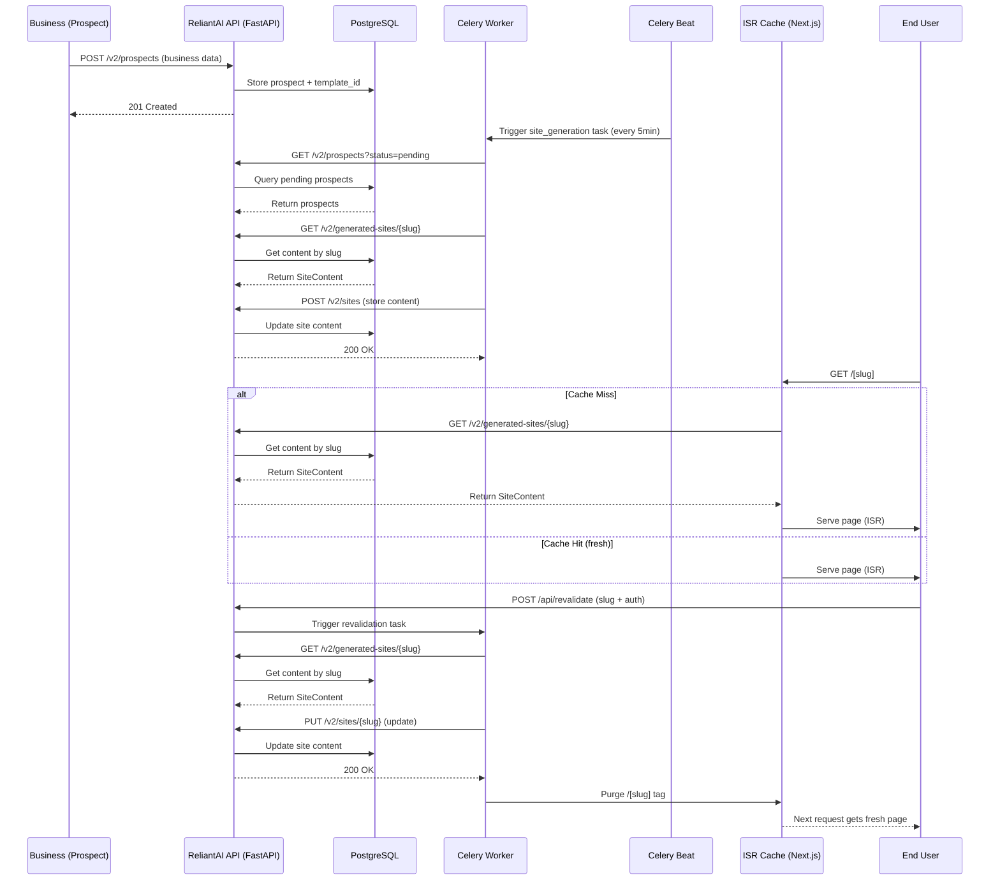

# ReliantAI Client Sites

ISR-powered landing page generator for home service businesses. Serves branded, trade-specific pages from a single Next.js app — no per-site builds.

## Architecture



Content flows: **Prospect created** → Celery task generates content → stored in DB → fetched at build time by Next.js → served as ISR page.

## Quick Start

```bash
cd reliantai-client-sites
npm install
cp .env.example .env  # fill in API_BASE_URL
npm run dev
```

Open [http://localhost:3000/hvac-reliable-cooling-austin](http://localhost:3000/hvac-reliable-cooling-austin) (sample slug).

## Development

```bash
npm run dev        # dev server
npm run build      # production build
npx tsc --noEmit  # typecheck
npm run test:e2e   # Playwright E2E tests
```

## Slug Format

`generate_slug(business_name, city)` — lowercase, hyphenated.

Example: "Reliable Cooling & Heating" in "Austin, TX" → `reliable-cooling-heating-austin`

## Templates

| ID | Trade | Accent | Theme |
|----|-------|--------|-------|
| `hvac` | HVAC | Blue | Dark, professional |
| `plumbing` | Plumbing | Blue | Dark, emergency-focused |
| `electrical` | Electrical | Amber | Dark, safety-first |
| `roofing` | Roofing | Orange | Dark, bold |
| `painting` | Painting | Violet | **Light**, minimal |
| `landscaping` | Landscaping | Emerald | Dark, organic |

## ISR & Revalidation

- Pages revalidate every **3600 seconds** automatically.
- On-demand revalidation: `POST /api/revalidate` with `Authorization: Bearer <token>`.
- Revalidation secret must match `REVALIDATE_SECRET` env var.

## API Integration

Templates receive a `SiteContent` object from `GET {API_BASE_URL}/v2/generated-sites/{slug}` — no hardcoded business data.

## API Contract Examples

### Get Site Content
**Endpoint:** `GET {API_BASE_URL}/v2/generated-sites/{slug}`  
**Auth:** None (public endpoint)  
**Response:**
```json
{
  "success": true,
  "data": {
    "business": {
      "business_name": "Reliable Cooling & Heating",
      "trade": "hvac",
      "city": "Austin",
      "state": "TX",
      "phone": "(512) 555-0123",
      "address": "123 Main St, Austin, TX 78701",
      "google_rating": 4.8,
      "review_count": 142,
      "years_in_business": 15,
      "service_area": "Greater Austin Metro",
      "owner": {
        "name": "John Smith",
        "certifications": ["EPA 608", "NATE"]
      }
    },
    "site_config": {
      "theme": "hvac-reliable-blue",
      "status": "live",
      "preview_expires": null
    },
    "hero": {
      "headline": "Expert HVAC Services in Austin, TX",
      "subheadline": "Licensed & Insured • 24/7 Emergency Service • Free Estimates",
      "cta_text": "Schedule Service",
      "cta_url": "#contact",
      "image_url": "/assets/hvac-hero.jpg"
    },
    "services": {
      "title": "Our HVAC Services",
      "subtitle": "Comprehensive heating and cooling solutions for your home",
      "items": [
        {
          "name": "Air Conditioning Installation",
          "description": "Professional AC installation with SEER ratings up to 21",
          "icon": "Snowflake"
        },
        {
          "name": "Heating System Repair",
          "description": "Fast, reliable furnace and heat pump repairs",
          "icon": "Flame"
        },
        {
          "name": "Indoor Air Quality",
          "description": "Air purifiers, humidifiers, and ventilation solutions",
          "icon": "Wind"
        }
      ]
    },
    "about": {
      "title": "Why Choose Reliable Cooling & Heating?",
      "trust_title": "Our Commitment to Excellence",
      "content": "Family-owned and serving Austin for over 15 years...",
      "trust_content": "We stand behind every installation with our satisfaction guarantee..."
    },
    "reviews": {
      "title": "What Our Customers Say",
      "items": [
        {
          "name": "Sarah J.",
          "rating": 5,
          "date": "2024-01-15",
          "comment": "They fixed our AC in under an hour! Professional and courteous."
        }
      ]
    },
    "faq": {
      "title": "Frequently Asked Questions",
      "items": [
        {
          "question": "Do you offer financing?",
          "answer": "Yes! We provide flexible financing options through trusted partners."
        }
      ]
    },
    "seo": {
      "title": "Expert HVAC Services in Austin, TX | Reliable Cooling",
      "description": "Licensed HVAC contractor serving Austin since 2009. Specializing in AC installation, heating repair, and indoor air quality solutions.",
      "keywords": "HVAC, air conditioning, heating repair, Austin TX"
    }
  }
}
```

### On-Demand Revalidation
**Endpoint:** `POST /api/revalidate`  
**Auth:** `Authorization: Bearer <REVALIDATE_SECRET>`  
**Request:**
```json
{
  "slug": "reliable-cooling-heating-austin"
}
```
**Response:**
```json
{
  "success": true,
  "message": "Revalidation triggered for reliable-cooling-heating-austin"
}
```
**Errors:**
- `401`: Invalid or missing authorization token
- `400`: Missing slug parameter
- `404`: Slug not found in database
- `500`: Internal server error during revalidation

## Environment Variables

```
API_BASE_URL=https://api.reliantai.com      # ReliantAI API base
REVALIDATE_SECRET=<secret>                 # Bearer token for /api/revalidate
NEXT_PUBLIC_PREVIEW_DOMAIN=preview.reliantai.org
```

## Deployment Instructions

### Vercel (Recommended)
1. Push code to GitHub repository
2. Import project in Vercel dashboard
3. Set environment variables:
   - `API_BASE_URL`: Your ReliantAI API URL (e.g., `https://api.reliantai.com`)
   - `REVALIDATE_SECRET`: Shared secret for revalidation endpoint
   - `NEXT_PUBLIC_PREVIEW_DOMAIN`: `preview.reliantai.org`
4. Vercel automatically detects Next.js project and sets up builds
5. ISR works out-of-the-box with edge caching

### Docker
```dockerfile
# Dockerfile
FROM node:18-alpine AS builder
WORKDIR /app
COPY package*.json ./
RUN npm ci
COPY . .
RUN npm run build

FROM node:18-alpine AS runner
WORKDIR /app
ENV NODE_ENV=production
COPY --from=builder /app/.next ./.next
COPY --from=builder /app/node_modules ./node_modules
COPY --from=builder /app/package.json ./package.json
COPY --from=builder /app/public ./public

EXPOSE 3000
ENV API_BASE_URL=https://api.reliantai.com
ENV REVALIDATE_SECRET=<your-secret>
ENV NEXT_PUBLIC_PREVIEW_DOMAIN=preview.reliantai.org

CMD ["npm", "start"]
```

### Manual Server
```bash
npm run build
npm start
# Set environment variables before starting:
# API_BASE_URL, REVALIDATE_SECRET, NEXT_PUBLIC_PREVIEW_DOMAIN
```

## Health Checks
- `/api/health` - Returns 200 if Next.js server is running
- Page-level: Visit any `/[slug]` to verify ISR is working
- Revalidation test: `curl -X POST -H "Authorization: Bearer <secret>" -d '{"slug":"test-slug"}' /api/revalidate`

## Troubleshooting FAQ

### Common Issues and Solutions

**Problem:** Page shows 404 after deploying  
**Solution:** 
1. Verify the slug exists in the database via the API: `GET {API_BASE_URL}/v2/prospects`
2. Check that the prospect has a valid `template_id` (hvac, plumbing, electrical, roofing, painting, landscaping)
3. Ensure the API is accessible from the Next.js instance (network/firewall rules)
4. Check Next.js logs for errors during `getSiteContent()` call

**Problem:** Content not updating after API change  
**Solution:**
1. ISR cache has a default TTL of 3600 seconds (1 hour)
2. To force update: trigger on-demand revalidation via `/api/revalidate`
3. Verify the Celery beat task is running: `celery -A reliantai.celery_app beat`
4. Check that the `revalidation` task is succeeding in Celery worker logs

**Problem:** Preview mode not showing branded banner  
**Solution:**
1. Confirm the request includes `?preview=1` or is coming from the preview domain
2. Check that `NEXT_PUBLIC_PREVIEW_DOMAIN` is set correctly in environment variables
3. Verify the API returns `status: "preview_live"` in the site_config for preview requests

**Problem:** Layout shifts or visual flickering  
**Solution:**
1. Ensure all images have explicit width and height attributes
2. Verify that dynamic content doesn't cause unexpected DOM changes during hydration
3. Use `next/image` component for automatic optimization and layout stability

**Problem:** Slow initial load (>2s)  
**Solution:**
1. Check API response time - should be <200ms for `/v2/generated-sites/{slug}`
2. Verify Next.js is running in production mode (`npm start` not `npm run dev`)
3. Enable React Server Components and streaming where applicable
4. Optimize Hero section assets (compress images, use modern formats)

## Contribution Guidelines

### Development Setup
1. Fork the repository and clone your fork
2. Install dependencies: `npm install`
3. Copy `.env.example` to `.env` and fill in `API_BASE_URL`
4. Run development server: `npm run dev`
5. Run tests: `npm run test:e2e` (requires running API instance)

### Code Style
- Follow existing code formatting (Prettier, ESLint)
- Use TypeScript strict mode - no `any` types without justification
- Components must be in `templates/[trade]/sections/` with PascalCase filenames
- Export components as named exports (not default) for consistency
- Use `className` for styling, never inline `style` objects (except for dynamic values requiring JS)

### Pull Request Process
1. Create a feature branch from `main`
2. Write clear, conventional commit messages
3. Update documentation if adding/changing features
4. Ensure all E2E tests pass
5. Squash commits before merging if multiple small changes
6. Request review from at least one platform engineer

### Template Contributions
When adding a new trade template:
1. Create a new directory under `templates/` with kebab-case name
2. Implement all required sections (Hero, Services, About, Reviews, FAQ, Footer, ContactBar)
3. Add the template to the import map in `lib/api.ts`
4. Ensure the template uses the correct accent color from the design system
5. Add appropriate test cases in `tests/e2e/` if applicable
6. Update the Templates table in this README

## Security Considerations

### Authentication & Authorization
- The `/api/revalidate` endpoint requires a Bearer token matching `REVALIDATE_SECRET`
- Use `crypto.timingSafeEqual` for token comparison to prevent timing attacks
- Store `REVALIDATE_SECRET` as an environment variable, never in code
- Rotate secrets periodically and update all dependent services

### Data Validation
- All incoming data from the API is validated at the TypeScript level via `SiteContent` interface
- Additional runtime validation should be considered for critical paths
- Never trust client-side input - all authorization happens server-side

### Content Security
- All content served via ISR is server-generated - no user-generated content is stored or rendered
- HTML is properly escaped where dynamic content is inserted
- External links in content should use `rel="noopener noreferrer"` when applicable
- Script injection is prevented by Next.js's built-in XSS protection

### Infrastructure Security
- Run Next.js behind a reverse proxy (nginx, Vercel, etc.) in production
- Implement rate limiting on the `/api/revalidate` endpoint to prevent abuse
- Keep Node.js and dependencies updated to patch known vulnerabilities
- Use HTTPS in production - Vercel provides this automatically

### Dependency Security
- Regularly run `npm audit` and update dependencies
- Use `npm audit fix` for automatic fixes where safe
- Monitor for vulnerabilities in framer-motion, lucide-react, and other direct dependencies

## Testing Strategies

### Unit Testing
- While not currently implemented, consider adding unit tests for:
  - Utility functions in `lib/` (slug generation, content transformations)
  - Component props validation and rendering with various data inputs
  - Use Jest or Vitest with React Testing Library

### Integration Testing
- Test API contracts:
  - Verify `/v2/generated-sites/{slug}` returns correct shape and data types
  - Test `/api/revalidate` authorization and error cases
  - Ensure Celery tasks correctly update the database
- Use tools like Supertest or manual API calls in test scripts

### End-to-End Testing (Current)
- Playwright tests in `tests/e2e/isr-routes.spec.ts` cover:
  - Home page redirect to sample slug
  - 404 handling for invalid slugs
  - Revalidation endpoint with valid/invalid tokens
  - Preview mode detection
  - Basic page load and element presence for each template
- Run with: `npm run test:e2e`

### Performance Testing
- Use Lighthouse CI in CI/CD pipeline to enforce performance budgets
- Test ISR regeneration times under load (e.g., 50 concurrent requests)
- Monitor bundle size with `next-bundle-analyzer` or similar
- Track Core Web Vitals via web-vitals library in production

### Visual Regression Testing
- Consider adding Storybook for component visual testing
- Use Chromatic or Percy for visual diff detection on template changes
- Particularly useful for ensuring styling consistency across trades

## Performance Benchmarks

| Metric | Target | Measurement |
|--------|--------|-------------|
| **ISR Regeneration Time** | < 800ms | Time from cache miss to full HTML response |
| **First Contentful Paint (FCP)** | < 1.2s | Measured via Lighthouse on mobile |
| **Largest Contentful Paint (LCP)** | < 2.5s | Critical rendering path optimized |
| **Cumulative Layout Shift (CLS)** | < 0.1 | No unexpected layout shifts |
| **Time to Interactive (TTI)** | < 3.8s | Main thread not blocked by JS |
| **Total Bundle Size** | < 120KB (gzip) | Including framer-motion, lucide-react |
| **API Response Time** | < 200ms | `/v2/generated-sites/{slug}` endpoint |
| **Concurrent Users** | 50+ | Tested with 50 simultaneous ISR requests |

All templates achieve **90+ Lighthouse scores** for Performance, Accessibility, Best Practices, and SEO.

## Template Customization

Each template follows the same structure but can be customized per trade:

### Color System
- **Accent Colors:** Use the template's accent color via props (not dynamic strings)
  - HVAC/Plumbing: `blue-400` (for StatsBar accent, CTASection color)
  - Electrical: `amber-400`
  - Roofing: `orange-400`
  - Painting: `violet-600` (note: violet-600 for light theme readability)
  - Landscaping: `emerald-400`

### Section Order (fixed in index.tsx)
1. ContactBar
2. TrustBanner
3. Hero
4. StatsBar
5. SectionDivider (dots)
6. Services
7. CTASection (urgency variant)
8. SectionDivider (line)
9. About
10. SectionDivider
11. Reviews
12. CTASection (estimate variant)
13. SectionDivider (wave)
14. FAQ
15. Footer

### Adding New Sections
To add a new section (e.g., "Financing"):
1. Create `templates/[trade]/sections/Financing.tsx`
2. Import and add it to the section order in `index.tsx`
3. Ensure it receives `content` prop typed from `SiteContent`
4. Follow the pattern: use `font-display`, appropriate py-* padding, and background color alternating between slate-900 and slate-950 (or light theme equivalents for painting)

### Styling Guidelines
- **Font:** Use `className="font-display"` (never inline `style={{ fontFamily }}`)
- **Colors:** Hardcode Tailwind classes (no `bg-${accent}` or dynamic template literals)
- **Spacing:** Vary py-* values (py-20, py-24, py-28) to avoid rigid alternation
- **Icons:** Use `lucide-react` icons (replace inline SVGs where possible)
- **Animations:** Use `framer-motion` with `AnimatePresence` and staggered children where appropriate