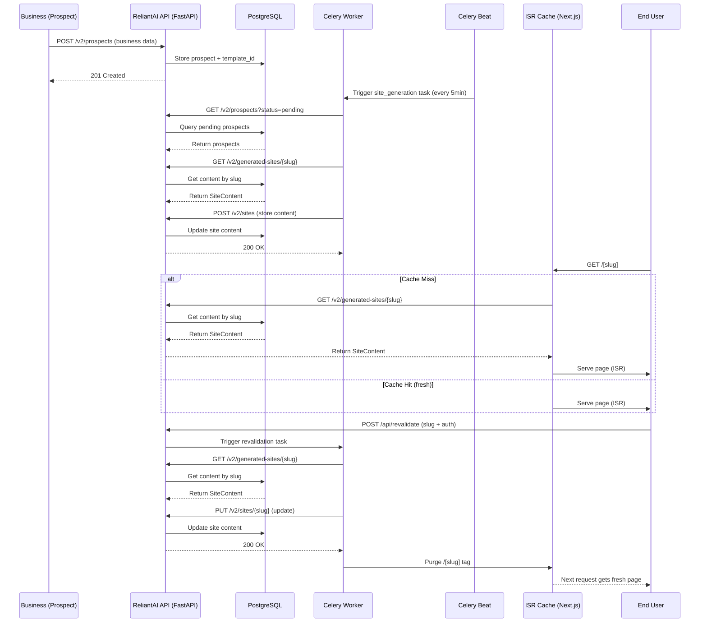

# ReliantAI Client Sites

ISR-powered landing page generator for home service businesses. Serves branded, trade-specific pages from a single Next.js 16 app — **no per-site builds**.

**Full instruction manual:** [`docs/CLIENT_SITES_MANUAL.md`](../docs/CLIENT_SITES_MANUAL.md) (deployment, API contract, revalidation, troubleshooting)

## Current Status — Phase 5: Deployment Verification

| Area | Status |
|------|--------|
| ISR hardening (slug validation, JSON-LD safety, API parsing) | ✅ Merged |
| Playwright E2E (13 tests + mock API server) | ✅ Passing |
| `build` / `typecheck` / `lint` gates | ✅ Passing |
| Vercel production deploy + `API_BASE_URL` | 🔲 Configure in Vercel |
| Live slug verification at `preview.reliantai.org` | 🔲 Post-deploy |

## Architecture



Content flows: **Prospect created** → Celery task generates content → stored in DB → fetched at build time by Next.js → served as ISR page.

## Quick Start

```bash
cd reliantai-client-sites
npm install
cp .env.example .env.local   # API_BASE_URL, REVALIDATE_SECRET
npm run dev                  # http://localhost:3000
```

Open [http://localhost:3000/showcase](http://localhost:3000/showcase) to browse templates.

## Routes

| Path | Type | Purpose |
|------|------|---------|
| `/` | Static | Redirects to `/showcase` |
| `/[slug]` | ISR (dynamic) | Renders a client site page from API content. Revalidates every 3600s. |
| `/showcase` | Static | Interactive template showcase — 4 view modes, device frames, live editing |
| `/preview` | Static | Simplified template preview with JSON data viewer |
| `/api/revalidate` | Server (POST) | On-demand ISR cache purge for a specific slug |

### Showcase (`/showcase`)

Interactive design studio for browsing, comparing, and generating all 6 templates:

- **Preview** — Full template with device frames (Desktop w/ macOS chrome, Tablet, Mobile w/ notch)
- **Grid** — All 6 templates rendered simultaneously with hover actions
- **Prompt** — Syntax-highlighted generation prompt with metadata cards and copy-to-clipboard
- **Compare** — Side-by-side with independent selectors for each panel

**Keyboard shortcuts:** `↑↓` cycle templates, `\` toggle sidebar

**Live data editing:** Override business name, phone, city/state, and headline in the sidebar with real-time preview updates.

### Preview (`/preview`)

Simpler template selector with:
- Full-page rendering for each template
- Grid layout (all templates side-by-side)
- Raw JSON data viewer with copy-to-clipboard

## Development

```bash
npm run dev        # dev server (Turbopack, port 3000)
npm run build      # production build
npm run typecheck  # next typegen && tsc --noEmit
npm run lint       # ESLint
npm run test       # Playwright E2E (13 tests; starts mock API on :8765)
```

> **Turbopack note:** If `next dev` crashes with file watch errors, increase inotify limit:
> ```bash
> echo fs.inotify.max_user_watches=524288 | sudo tee -a /etc/sysctl.conf
> sudo sysctl -p
> ```
> Or use `next build && next start` instead.

## Slug Format

`generate_slug(business_name, city)` — lowercase, hyphenated.

Example: "Reliable Cooling & Heating" in "Austin, TX" → `reliable-cooling-heating-austin`

## Templates

All 6 templates share a common 15-section layout (ContactBar → TrustBanner → Hero → StatsBar → Services → CTASection → About → Reviews → CTASection → FAQ → Footer) with trade-specific variations:

| ID | Trade | Accent | Theme | Hero Layout | Personality | Best For |
|----|-------|--------|-------|-------------|-------------|----------|
| `hvac-reliable-blue` | HVAC | Blue | Dark | Single-column | Dependable & Authoritative | Any trade where trust is paramount |
| `plumbing-trustworthy-navy` | Plumbing | Navy (Blue) | Dark | Single-column | Urgent & Trustworthy | Emergency/24/7 services |
| `electrical-sharp-gold` | Electrical | Amber/Gold | Dark | Dual + Safety Card | Bold & Safety-First | Safety-credentialed trades |
| `roofing-bold-copper` | Roofing | Orange/Copper | Dark | Dual + Credential Stack | Bold & Action-Oriented | Free-inspection offers |
| `painting-clean-minimal` | Painting | Violet | **Light** | Dual + Decorative | Clean & Design-Forward | Aesthetics-driven trades |
| `landscaping-earthy-green` | Landscaping | Emerald | Dark | Dual + Decorative | Organic & Sustainable | Outdoor services |

### Key Differentiators

| Template | Unique Features |
|----------|----------------|
| **HVAC** | Editorial narrative About (sentence-split), equal service cards, masonry reviews |
| **Plumbing** | Red emergency alert badge with animate-ping, featured service card, featured review split |
| **Electrical** | SAFETY FIRST hero card, uniform slate-950 bg, `rounded-lg` CTAs, featured at index 2 |
| **Roofing** | Animated ping dot, 3-card hero credential stack, trust points as card grid, `border-2` CTAs |
| **Painting** | Only light theme, concentric violet circles, serif quote marks, dark footer contrast |
| **Landscaping** | Scale animation on hero, concentric emerald circles, centered About with vertical bar |

### Generation Prompts

Each template has a complete, production-ready generation prompt viewable in the **Prompt** tab of the Showcase. Prompts include:
- Complete color system with hex values and Tailwind classes
- Exact layout structure with section order and grid configurations
- All animation patterns (framer-motion variants, stagger timing)
- Unique visual features specific to that template
- CTA styling (border-radius, hover effects, shadow configurations)
- Typography scale (heading sizes, weight, tracking)

## ISR & Revalidation

- Pages revalidate every **3600 seconds** automatically.
- On-demand revalidation: `POST /api/revalidate` with `Authorization: Bearer <token>`.
- Revalidation secret must match `REVALIDATE_SECRET` env var.

## API Integration

Templates receive a flat `SiteContent` object from `GET {API_BASE_URL}/api/v2/generated-sites/{slug}` — no wrapper, no auth.

Pipeline: `lib/api.ts` → `lib/validate-site-content.ts` → `lib/templates.ts` (dynamic import). Invalid slugs are rejected by `lib/slug.ts` before any fetch.

### Mock Data (`lib/mock-data.ts`)

Each trade has a complete mock dataset with:
- Realistic business name, city, phone, email, address
- 5 unique reviews per trade with trade-appropriate text
- 4 trade-specific services with descriptions and CTAs
- 3–4 trade-specific FAQs
- Full SEO metadata and AEO signals
- Schema.org structured data

## API Contract Examples

### Get Site Content
**Endpoint:** `GET {API_BASE_URL}/api/v2/generated-sites/{slug}`  
**Auth:** None (public endpoint)  
**Response:** Flat `SiteContent` object (no `{ success, data }` wrapper). **404:** `{ "detail": "Site not found" }`

```json
{
    "slug": "comfort-pro-hvac-austin-ab12",
    "status": "preview_live",
    "business": {
      "business_name": "Reliable Cooling & Heating",
      "trade": "hvac",
      "city": "Austin",
      "state": "TX",
      "phone": "(512) 555-0123",
      "address": "123 Main St, Austin, TX 78701",
      "google_rating": 4.8,
      "review_count": 142,
      "years_in_business": 15,
      "service_area": "Greater Austin Metro"
    },
    "site_config": {
      "template_id": "hvac-reliable-blue",
      "trade": "hvac",
      "theme": { "primary": "#1e40af", "accent": "#60a5fa", "font_display": "Outfit", "font_body": "Inter" }
    },
    "hero": {
      "headline": "Stay Comfortable Austin",
      "subheadline": "Same-day HVAC service for homes that need reliable heating and cooling",
      "cta_primary": "Call Now",
      "cta_primary_url": "tel:+15125550199",
      "cta_secondary": "View Services",
      "cta_secondary_url": "#services",
      "trust_bar": ["Licensed & Insured", "EPA Certified"]
    },
    "services": [
      {
        "icon": "thermometer",
        "title": "AC Repair & Install",
        "description": "Same-day diagnostics and repair with 10-year warranty",
        "cta_text": "Get AC Help"
      }
    ],
    "about": {
      "story": "Comfort Pro started in 2009...",
      "trust_points": ["15+ years serving Austin homeowners", "4.9-star rating"],
      "certifications": ["EPA 608 Certified", "NATE Certified"]
    },
    "reviews": {
      "reviews": [{ "author": "Sarah M.", "rating": 5, "text": "They came out same day...", "time": "2 weeks ago" }],
      "aggregate_line": "4.9 average from 342 reviews"
    },
    "faq": [
      { "question": "How fast can you get here?", "answer": "For emergencies, we typically arrive within 2 hours." }
    ],
    "seo": {
      "title": "Comfort Pro HVAC — Austin's Most Trusted HVAC Company",
      "description": "Same-day HVAC repair and installation in Austin. Call (512) 555-0199.",
      "keywords": ["hvac austin", "ac repair austin"]
    },
    "aeo_signals": {
      "local_business_type": "HVACContractor",
      "primary_category": "HVAC Repair",
      "secondary_categories": ["AC Installation"],
      "area_served": ["Austin", "Round Rock", "Cedar Park"]
    },
    "schema_org": { "@context": "https://schema.org", "@type": "HVACBusiness" },
    "meta_title": "Comfort Pro HVAC — Austin",
    "meta_description": "Same-day HVAC repair in Austin.",
    "lighthouse_score": 95
}
```

### On-Demand Revalidation
**Endpoint:** `POST /api/revalidate`  
**Auth:** `Authorization: Bearer <REVALIDATE_SECRET>`  
**Request:**
```json
{ "slug": "reliable-cooling-heating-austin" }
```
**Response (200):**
```json
{ "revalidated": true, "slug": "reliable-cooling-heating-austin" }
```
**Errors:**
- `503`: `REVALIDATE_SECRET` not configured
- `401`: Invalid or missing Bearer token
- `400`: Missing or invalid slug (must match `^[a-z0-9]+(?:-[a-z0-9]+)*$`, max 100 chars)

## Environment Variables

See `.env.example` for the full list:

| Variable | Required | Description |
|----------|----------|-------------|
| `API_BASE_URL` | Yes (prod) | Platform API base URL |
| `REVALIDATE_SECRET` | Yes (prod) | Bearer token for `/api/revalidate` (server-only) |
| `NEXT_PUBLIC_CHECKOUT_BASE_URL` | No | Preview banner checkout links (default: `https://reliantai.org`) |
| `API_TIMEOUT_MS` | No | Server fetch timeout (default: 10000) |

## Deployment Instructions

### Vercel (Recommended)
1. Push code to GitHub repository
2. Import project in Vercel dashboard
3. Set environment variables
4. Vercel automatically detects Next.js and sets up ISR

### Docker
```dockerfile
FROM node:20-alpine AS builder
WORKDIR /app
COPY package*.json ./
RUN npm ci
COPY . .
RUN npm run build

FROM node:20-alpine AS runner
WORKDIR /app
ENV NODE_ENV=production
COPY --from=builder /app/.next ./.next
COPY --from=builder /app/node_modules ./node_modules
COPY --from=builder /app/package.json ./package.json
COPY --from=builder /app/public ./public

EXPOSE 3000
ENV API_BASE_URL=https://api.reliantai.com
ENV REVALIDATE_SECRET=<your-secret>
ENV NEXT_PUBLIC_PREVIEW_DOMAIN=preview.reliantai.org

CMD ["npm", "start"]
```

## Routes Summary

```
/                  → redirects to /showcase
/[slug]            → ISR-rendered client site (revalidate: 3600)
/showcase          → interactive template studio (4 views)
/preview           → simplified template browser
/api/revalidate    → POST endpoint for ISR cache purge
/api/health        → health check (returns 200)
```

## File Structure

```
app/
├── [slug]/                 # ISR dynamic route
│   └── page.tsx
├── api/
│   └── revalidate/         # POST handler
├── showcase/page.tsx       # Interactive template studio
├── preview/page.tsx        # Simplified template browser
├── page.tsx                # Redirects to /showcase
├── layout.tsx
└── globals.css

components/
├── shared/                 # StatsBar, CTASection, TrustBanner, SectionDivider
└── showcase/               # DeviceFrame, CodeBlock

templates/
├── hvac-reliable-blue/sections/
├── plumbing-trustworthy-navy/sections/
├── electrical-sharp-gold/sections/
├── roofing-bold-copper/sections/
├── painting-clean-minimal/sections/
└── landscaping-earthy-green/sections/

lib/
├── api.ts                  # SiteContent fetcher + template loader
├── slug.ts                 # Slug validation (path traversal block)
├── templates.ts            # Template registry (single source of truth)
├── validate-site-content.ts # API response shape validation
├── serialize-json-ld.ts    # Safe JSON-LD (< escaped as \u003c)
├── mock-data.ts            # Complete mock SiteContent per trade
├── template-meta.ts        # Rich metadata + generation prompts
└── trade-copy.ts           # Trade-specific copy for all sections

types/
└── SiteContent.ts           # TypeScript interfaces

tests/
├── mocks/api-server.mjs    # Mock platform API for E2E
├── fixtures/site-content.mjs
└── e2e/
    ├── isr-routes.spec.ts
    └── site-rendering.spec.ts
```

## Health Checks
- `GET /api/health` — Returns 200 if Next.js server is running
- Page-level: Visit any `/[slug]` to verify ISR is working
- Revalidation test: `curl -X POST -H "Authorization: Bearer <secret>" -d '{"slug":"test-slug"}' /api/revalidate`

## Troubleshooting FAQ

**Problem:** Page shows 404 after deploying  
**Solution:** Verify the slug exists in the database and has a valid `template_id`.

**Problem:** Content not updating after API change  
**Solution:** Trigger on-demand revalidation via `/api/revalidate`. ISR cache has a 3600s TTL.

**Problem:** Preview mode not showing branded banner  
**Solution:** Confirm the API returns `status: "preview_live"` in the site_config.

**Problem:** Layout shifts or visual flickering  
**Solution:** Ensure images have explicit dimensions, verify dynamic content doesn't cause DOM changes.

**Problem:** Slow initial load (>2s)  
**Solution:** Check API response time (<200ms), ensure production mode, optimize hero assets.

## Contribution Guidelines

When adding a new trade template:
1. Create a new directory under `templates/` with kebab-case name
2. Implement all required sections (Hero, Services, About, Reviews, FAQ, Footer, ContactBar)
3. Register in `lib/templates.ts` and add mock data in `lib/mock-data.ts`
4. Add metadata and generation prompt to `lib/template-meta.ts`
5. Add a TemplateCard entry in `app/showcase/page.tsx`
6. Use the correct accent color variant for StatsBar, CTASection, and SectionDivider
7. Add appropriate test cases in `tests/e2e/`
8. Update the Templates table in this README

## Security Considerations

- Slug validation blocks path traversal (`lib/slug.ts` + `encodeURIComponent` in fetch URL)
- JSON-LD serialized with `<` escaped (`lib/serialize-json-ld.ts`)
- `/api/revalidate` uses timing-safe Bearer compare; returns 503 if secret unset
- API responses validated before render (`lib/validate-site-content.ts`)
- Security headers in `next.config.ts` (`nosniff`, `SAMEORIGIN`, `Referrer-Policy`)
- `REVALIDATE_SECRET` is server-only — never exposed via `next.config` `env`

## Performance Benchmarks

| Metric | Target |
|--------|--------|
| ISR Regeneration Time | < 800ms |
| First Contentful Paint | < 1.2s |
| Largest Contentful Paint | < 2.5s |
| Cumulative Layout Shift | < 0.1 |
| Total Bundle Size | < 120KB (gzip) |
| API Response Time | < 200ms |

All templates achieve **90+ Lighthouse scores** for Performance, Accessibility, Best Practices, and SEO.

## Styling Guidelines

- **Font:** Use `font-display` (never inline `style={{ fontFamily }}`)
- **Colors:** Hardcode Tailwind classes (no `bg-${accent}` dynamic strings)
- **Spacing:** Vary py-* values (py-20, py-24, py-28) to avoid rigid alternation
- **Icons:** Use `lucide-react` icons
- **Animations:** Use `framer-motion` with `AnimatePresence` and staggered children where appropriate